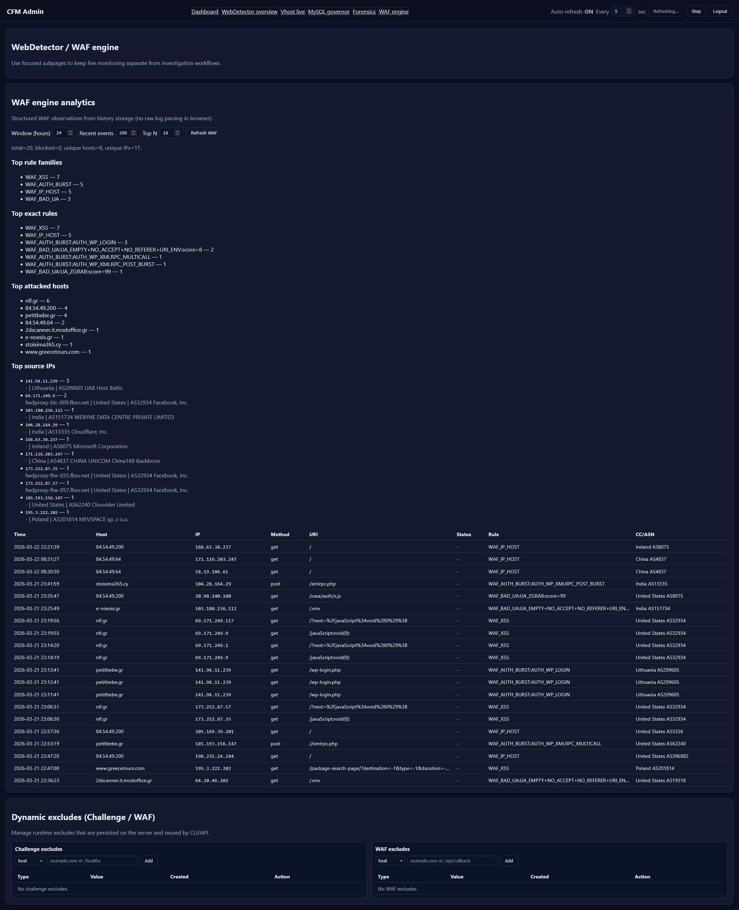
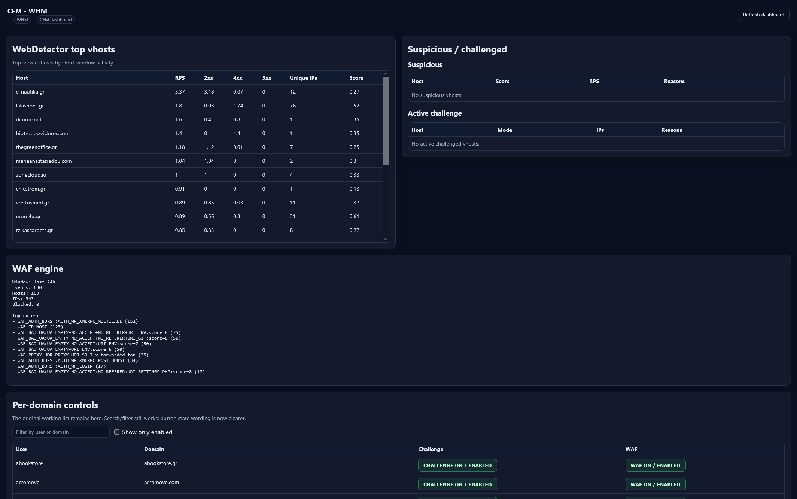
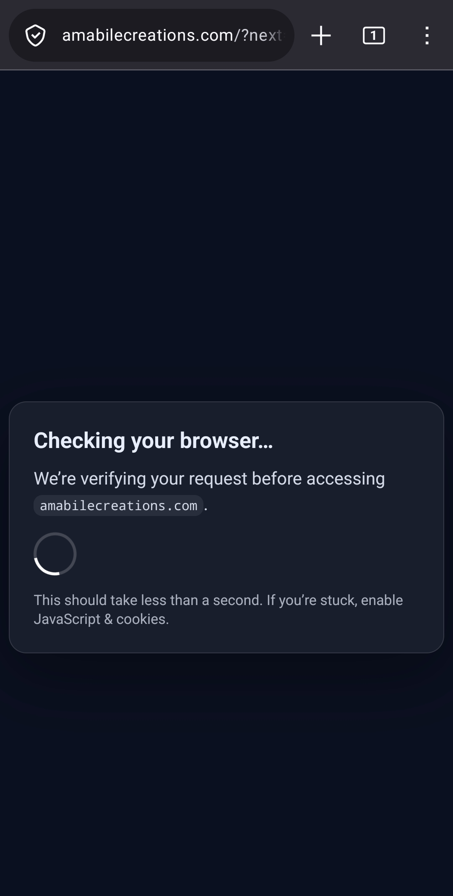
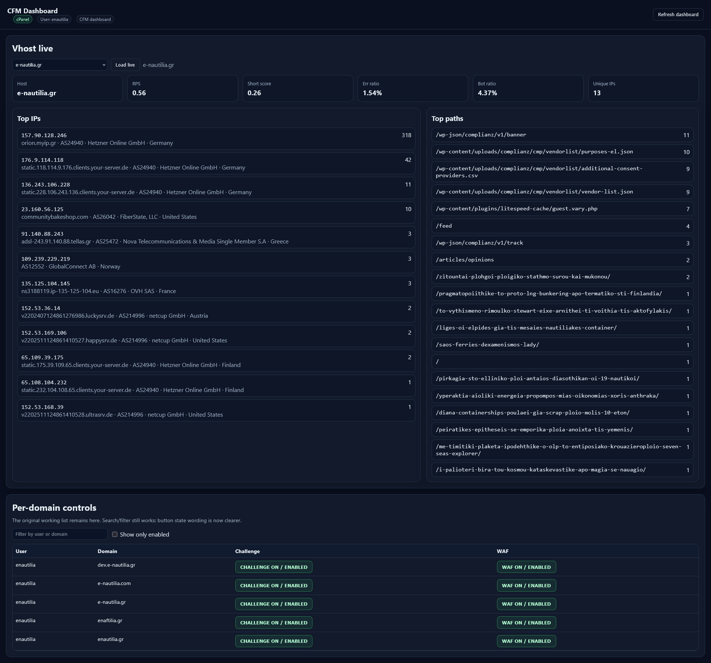

# CFM – Configurable Firewall Manager
<p align="center">
  High-performance L3–L7 firewall, WAF & challenge engine for modern hosting stacks
</p>

<p align="center">
  
</p>

<p align="center">
  
  
  
  
</p>


CFM is a modern Go-based firewall + detection + mitigation daemon.
It combines nftables policy enforcement, log-driven detectors, enrichment, notifications,
and an HTTP challenge engine that can be enforced either via nftables redirect/DNAT or directly
in-path through a decision socket read from an edge proxy.

The in-path edge proxy can be either **OpenResty** (the original/default) or **Angie**
(an nginx fork by former nginx core developers, supported as of CFM 1.0+). Either one
works as an Edge Interceptor filtering all traffic; the CFM daemon, Lua decision files,
and sslcollector socket are identical for both. See [Section 8](#8-in-path-mode-openresty--angie)
for the trade-offs and how to choose.

> More information: https://infected.gr/category/cfm/

---

## Table of Contents

1. [What is CFM?](#1-what-is-cfm)
2. [Installation](#2-installation)
   - [Web UI quick start (recommended)](#web-ui-quick-start-recommended)
3. [Repository Layout](#3-repository-layout)
4. [Configuration Files](#4-configuration-files)
5. [Key Features](#5-key-features)
   - [Firewall Core](#-firewall-core)
   - [Connection Protections](#-connection-protections)
   - [Detection Engine](#-detection-engine)
   - [Autoblock Engine](#-autoblock-engine)
   - [Outbound Abuse Sentinel](#-outbound-abuse-sentinel)
6. [Web Detector](#6-web-detector)
   - [Ingestion Modes](#ingestion-modes)
   - [Log Line Format](#log-line-format-tsv)
   - [Configuration Examples](#configuration-examples)
   - [Hard-Block Triggers](#web-abuse-hard-block-triggers)
   - [Suspicious Scoring](#suspicious-scoring)
7. [Challenge System](#7-challenge-system)
   - [DNAT Mode](#dnat-mode)
   - [Challenge Triggers](#challenge-triggers)
   - [Challenge Abuse Protection](#challenge-abuse-protection)
8. [In-Path Mode (OpenResty / Angie)](#8-in-path-mode-openresty--angie)
   - [Architecture](#architecture)
   - [OpenResty vs Angie — choosing a backend](#openresty-vs-angie--choosing-a-backend)
   - [Smart Lua WAF Layer](#smart-lua-waf-layer)
   - [Advanced Challenge Rules](#advanced-challenge-rules)
9. [SSLCollector](#9-sslcollector)
10. [MySQL Governor](#10-mysql-governor)
    - [Overview](#overview)
    - [MySQL Grants](#mysql-grants)
    - [Operating Modes](#operating-modes)
    - [Dedicated Log Channel](#dedicated-log-channel)
    - [Connection Pressure](#connection-pressure)
    - [Lock Fan-out Kill](#lock-fan-out-kill)
    - [Query Rules — QUERY_RULES](#query-rules--query_rules)
    - [Connection Limit Rules — CONN_RULES](#connection-limit-rules--conn_rules)
    - [Sleep Reaper](#sleep-reaper)
    - [Kill Rate Limiting](#kill-rate-limiting)
    - [CPU and Performance Tracking](#cpu-and-performance-tracking)
    - [CLI Reference — cfm mysqltop](#cli-reference--cfm-mysqltop)
    - [HTTP API](#http-api)
    - [Full detectors.conf Example](#full-detectorsconf-example)
11. [CLI Reference – `cfm webtop`](#11-cli-reference--cfm-webtop)
12. [Web Detector HTTP API](#12-web-detector-http-api)
13. [Appendix: cfm.conf Snippets](#13-appendix-cfmconf-snippets)
14. [Security Notes](#14-security-notes)

---

## 1. What is CFM?

CFM is a **unified L3–L7 enforcement platform** — a single Go binary with a direct nftables
backend and no iptables dependency.

| Layer | Function |
|---|---|
| L3/L4 | Firewall, IDS/IPS, connection/rate limiting, system hardening |
| L7 | Behavioral Web Detection, OWASP-inspired WAF, Interactive Challenge Engine |
| MySQL | Processlist governor, runaway query kill, connection-limit enforcement |
| Support | Enrichment (PTR / ASN / Country), TLS-aware smart bridge, notifications |



**What makes it unique:**
- Single Go binary, low footprint
- Direct nftables backend (no iptables dependency)
- Broad detector coverage: SSH, Exim, Dovecot, FTP, MySQL, cPanel, ModSecurity, Web
- Web Detector that can escalate to an **interactive challenge** instead of always hard-blocking
- MySQL Governor that can kill runaway queries and enforce per-user connection limits
- **Outbound Abuse Sentinel** — per-uid detection of SMTP bursts, scanner activity, HTTP fan-out and DNS amplification before your IPs land on blacklists
- ML-Ready: the scoring system is a hand-crafted classifier based on trusted signals

---

## 2. Installation

Ready-to-run packages are available for Debian and EL (AlmaLinux / Rocky / CloudLinux).

### Debian
```bash
wget -qO - https://repo.nixpal.com/debian/nixpal-repo.gpg | gpg --dearmor -o /etc/apt/trusted.gpg.d/nixpal-repo.gpg
wget https://repo.nixpal.com/debian/nixpal.list -O /etc/apt/sources.list.d/nixpal.list
apt update && apt install cfm
```

### EL (AlmaLinux / Rocky / CloudLinux)
```bash
dnf install https://repo.nixpal.com/el/nixpal.rpm
dnf install cfm
```

Both packages create the `cfm` system user and group automatically during installation.

### Web UI quick start (recommended)

Start with `cfm auth`, then log in to `/cfm-admin` and configure Notifier from UI.

1. Notifier now includes a Web UI for channels, routing, templates/dedupe, test send, history, and backups/restore.
2. First-time setup: run `cfm auth` initialization and create a login-capable user.
3. Login entry paths:
   - direct API port: `http(s)://<server>:<API_PORT>/cfm-admin`
   - via OpenResty/Angie interceptor: `http(s)://<hostname>/cfm-admin`
4. These paths serve the same UI and authentication flow.

#### Roadmap

- Notifier Web UI is available now.
- Detectors Settings UI phase 1 is available at `/cfm-admin/detectors/` with safe draft validation, diff preview, backup/restore and reload hooks.
- Phase 2 (planned): deeper webdetector key coverage and advanced modeling.

### Manual install (from source)

If you build from source and install without the package manager, create the system account first:

```bash
groupadd --system cfm
useradd --system --gid cfm --no-create-home \
        --home-dir /var/lib/cfm --shell /sbin/nologin \
        --comment "CFM service account" cfm
```

The `cfm` group is required for the SSLCollector unix socket and token file to be readable by OpenResty/Angie workers. The cfm daemon logs a warning at startup if the group is missing and the socket server is enabled.

---

## 3. Repository Layout

CFM ships **reference configs** under `configs/` (packaged to `/usr/share/cfm/configs/`) and
**live configs** under `/etc/cfm/`.

```text
  configs/
  cfm.conf                  # main daemon config (ports policy, nft, sysctl, maxmind, api, logs)
  detectors.conf            # detectors + thresholds + per-section BLOCK policies
  notify.conf               # notifier channels + dedupe + per-detector routing
  cfm.blocklists            # external feed definitions (ALLOW/BLOCK, refresh interval, etc.)
  cfm.allow / cfm.deny      # static allow/deny lists (IP/CIDR/host)
  cfm.ignore                # IPs that must never be blocked (global ignore list)
  cfm.dyndns                # hostnames resolved periodically and added to allow
  cfm-admin.htpasswd        # optional /cfm-admin BasicAuth file (shipped empty)
  httpd-cfm.conf            # Apache LogFormat for WebDetector TSV
  nginx-cfm.conf            # nginx log_format for WebDetector TSV
  sslcollector.lua          # Lua helper for dynamic cert loading (OpenResty/Angie, via unix socket)
  trusted_proxies.conf      # real_ip / trusted proxy include for Cloudflare/LB setups
  openresty.conf            # full OpenResty "in-path WAF/challenge" config
  angie.conf                # Angie equivalent of openresty.conf (for boxes where Angie is used instead)
  webdetector_*.txt         # webdetector path lists: challenge_paths, malpaths, exclude, etc.
  
  webui/cfm-admin/          # starter Vue-based /cfm-admin dashboard (WebTop MVP)
  docs/cfm-admin-webtop.md  # deployment/auth notes for /cfm-admin
packaging/
  debian/DEBIAN/*           # postinst/prerm/postrm, conffiles, etc.
  rpm/SPECS/cfm.spec
internal/
  detectors/                # ssh/mysql/ftp/exim/dovecot/cpanel/webdetector/modsec/health/postfix...
  notify/                   # notifier engine (sendmail/smtp/slack), dedupe, templates
  firewall/nft/             # nftables backend + hardening + ports policy
  sslcollector/             # cert discovery + socket API for OpenResty/Angie
```

---

## 4. Configuration Files

### `cfm.conf` — Main daemon config
- Ports policy: `TCP_IN`, `UDP_IN`, `TCP_OUT`, `UDP_OUT`
- nftables hook ordering: `NFT_INPUT_PRIORITY`
- Connection protections: `CONNLIMIT`, `PORTFLOOD`, `PKT_RATE/PKT_BURST`, `NEW_RATE/NEW_BURST`, `ICMP_*`
- Throttle-to-autoblock glue: `THROTTLE_*`
- Portscan tracking: `PS_*`
- MaxMind updater: `MAXMIND_*`
- **Why MMDB is critical**
  - MMDB databases are shared across CFM enrichment pipelines and power IP→country/ASN lookups used by detection, reporting, and automation flows.
  - The same MMDB data is also used by OpenResty/Angie integrations for country-aware location and filtering decisions.
- **Download source selection** (deterministic order)
  1. If both `MAXMIND_ACCOUNT_ID` and `MAXMIND_LICENSE_KEY` are set, CFM uses MaxMind GeoLite2 sources.
  2. Otherwise, CFM fetches open MMDB files from IPLocate GitHub raw URLs:
     - `https://github.com/iplocate/ip-address-databases/raw/refs/heads/main/ip-to-asn/ip-to-asn.mmdb`
     - `https://github.com/iplocate/ip-address-databases/raw/refs/heads/main/ip-to-country/ip-to-country.mmdb`
- **Canonical on-disk filenames**
  - CFM expects MMDB files to be present as `GeoLite2-ASN.mmdb` and `GeoLite2-City.mmdb`.
  - When fallback IPLocate sources are used, downloaded files are mapped/renamed to these canonical filenames on disk.
- API integration: `API_URL`, `AUTH_TOKEN`, `*_SEND_TO_API`
  - `AUTH_TOKEN` is **mandatory** when the internal API server is enabled (`PORT > 0` or `TLS_PORT > 0`) because privileged API routes require it.
  - API ports must stay firewalled by default (`PORT` usually `6060` plaintext and `TLS_PORT` usually `6061`) and should only be reachable from localhost or explicitly allowed sources (for example entries resolved from `cfm.allow` / `cfm.dyndns`).
  - When `API_URL` is configured, its destination IP is auto-added to the allow set so API callbacks still work with strict firewalling.
- Web-auth defaults (from `configs/cfm.conf` template):
  ```ini
  AUTH_DB_PATH = "/var/lib/cfm/auth.db"
  AUTH_SESSION_DB_PATH = "/var/lib/cfm/auth-sessions.db"
  AUTH_MFA_ENCRYPTION_KEY = ""
  AUTH_MFA_LOGIN_VERIFY_ENABLED = true
  AUTH_MFA_TOTP_ENROLL_ENABLED = false
  AUTH_MFA_TOTP_PILOT_USERS = ""
  AUTH_SESSION_TTL = "8h"
  AUTH_SECURE_COOKIE = 0
  AUTH_COOKIE_NAME = "cfm-sid"
  ```
- Debug server: `LISTEN_ADDRESS`, `PORT`
- MySQL governor log: `MYSQL_LOG_STDOUT`, `MYSQL_LOG_FILE`

### `detectors.conf` — Detection engine
- `[global]` defaults: `DEFAULT_EVERY`, `DEFAULT_TIMEOUT`, `DEFAULT_COOLDOWN`
- Global ignores: `IGNORE_IPS`, `IGNORE_NETS`, `LOG_IGNORED`
- Per-detector sections: `[ssh_auth]`, `[mysql]`, `[mysql_governor]`, `[ftpd]`, `[cpanel]`, `[exim_*]`, `[dovecot_*]`, `[postfix_*]`, `[modsec]`, `[health]`, `[webdetector]`
- API anomaly detector section: `[api_abuse]` (apiserver-origin anomalies with staged observe/challenge/block mitigation)
- Webdetector history knobs live in `[webdetector]` here (not in `cfm.conf`): `HISTORY_ENABLED`, `HISTORY_DB_PATH`, `HISTORY_RETENTION_DAYS`, `HISTORY_PRUNE_EVERY`
- Per-section block policy: `BLOCK = no|dryrun|permanent|<duration>` + `BLOCK_COOLDOWN`

### Detectors

CFM detector runtime config lives at **`/etc/cfm/detectors.conf`** (packaged baseline: `configs/detectors.conf`).

- Inline detector examples and templates: [`configs/detectors.conf`](configs/detectors.conf)
- Detector model, built-ins, and custom detector how-to: [`docs/DETECTORS.md`](docs/DETECTORS.md)
- Leniency tuning and `.leniency` companion sections: [`docs/Detectors.Leniency.md`](docs/Detectors.Leniency.md)

Capabilities at a glance:
- Built-in detectors for SSH, mail, FTP, MySQL, cPanel, ModSecurity, health, web traffic, and API abuse.
- Per-section block modes: `off`/`no`, `dryrun`, `permanent`, or duration TTL (for example `30m`, `2h`).
- Multiple log sources by detector: `file`, `journal`, and `docker` where supported.
- Custom regex detectors via `[custom:<name>]` sections (and expanding UI support as it becomes available).

> **Start safe:** set `BLOCK = dryrun` while tuning thresholds, regexes, and ignore lists; switch to TTL or `permanent` only after validation.

#### API abuse rollout guidance
- Start with detect-only by setting `[api_abuse]` `BLOCK = no` and tuning `STAGE1_THRESHOLD` from production logs.
- Enable gradual mitigation next: keep stage 1 as observe, set `STAGE2_THRESHOLD` + `STAGE2_CHALLENGE_TTL` for temporary challenge responses.
- Enable stage 3 only after baseline tuning: set `BLOCK = <short ttl>` (or `BLOCK=dryrun` first), then tune `STAGE3_THRESHOLD` and `BLOCK_COOLDOWN`.
- Use `ALLOW_IPS`, `ALLOW_NETS`, `ALLOW_UA_CONTAINS`, and `PATH_EXCEPTIONS` to exempt known monitors, proxies, and expected probe-like paths.

### `notify.conf` — Notifier
- Global on/off + JSONL audit log
- Dedupe keying: `[dedupe]`
- Channels: `sendmail`, `smtp`, `slack_webhook`
- Per-detector routing + severity gating: `[detector "..."]`

### `cfm.blocklists` — External feed pulls
Defines scheduled pulls of external feeds into allow/block sets.

### `cfm.dyndns` — Dynamic DNS allow
Hostnames periodically resolved and kept in the allow set (e.g. dynamic office IPs).

### Web log format snippets (`httpd-cfm.conf`, `nginx-cfm.conf`)
Ensures WebDetector sees a consistent TSV schema across stacks.

### Malformed request logging (OpenResty / Angie)
- In `configs/openresty.conf` and `configs/angie.conf`, malformed/empty request
  traffic is routed to `access.bad_request.log` (not the main `access.log` cfm
  format).
- The `cfm_bad_request` log format uses escaped output (`escape=json`) so
  control bytes are rendered safely for storage and parsing.
- When investigating these lines, prefer byte-aware viewers/parsers that
  preserve escaped sequences (for example: `jq -Rr .`, `python -m json.tool`,
  or SIEM/raw viewers that do not auto-unescape).


---

## 5. Key Features

### 🔒 Firewall Core
- nftables backend (auto-created table/chains)
- Hook priority control (`NFT_INPUT_PRIORITY`) to run before/after other stacks (CSF/Imunify)
- ALLOW/BLOCK sets (v4/v6) + dynamic allow via hostname/DynDNS resolution
- Port policy from config (`TCP_IN`, `UDP_IN`, etc.)
- SMTP_BLOCK mode (CSF-compatible pattern)

### ⚡ Connection Protections
- ConnLimit per port (concurrent connections per IP)
- PortFlood per port (new connection rate limits per IP)
- PPS limits: `PKT_RATE`, `PKT_BURST`, `PKT_MODE`
- New connection rate limiting: `NEW_RATE`, `NEW_BURST`
- ICMP rate limiting
- Bad TCP flag filtering (NULL / XMAS / SYN+FIN)

### 🔎 Detection Engine
Detectors parse logs/metrics to spot abuse:
- Exim (queues, auth failures, relay abuse)
- SSH (auth fails, brute force)
- Dovecot (auth fails)
- FTP (pure-ftpd / proftpd / vsftpd)
- cPanel logins
- MySQL denied / scanner attempts
- ModSecurity alerts
- Health detector (CPU / RAM / disk / SMART / RAID / ZFS / conntrack spikes)
- **MySQL Governor** (processlist monitor, runaway query kill, connection-limit enforcement — see [§10](#10-mysql-governor))
- **Web Detector** (see [§6](#6-web-detector))

### 🚨 Autoblock Engine
- Inserts IPs into nftables sets (TTL or permanent)
- Per-detector policies: `dryrun`, `ttl=1h`, `permanent`
- Dedupe suppression for noisy repeats (`host|kind|ip|reason`)
- Unified reasons: `SSH_BRUTE`, `PORTSCAN`, `CONNLIMIT`, `WEB_*`, etc.

### 📤 Outbound Abuse Sentinel

A direct counterpart to the inbound detection engine: instead of asking "who is
attacking us?" it asks "which of my hosted accounts is generating outbound
abuse?" — the question that decides whether your mail IPs end up on Spamhaus,
your egress IP gets nullrouted by your upstream, or a compromised PHP site
turns your server into a botnet node.

**What it does (phase 1 — observe + warn):**
- Watches new outbound TCP connections per Linux uid via NFLOG.
- Classifies each event by destination port group:
  - **SMTP** — outbound 25 / 465 / 587 (mail flood, compromised CMS sending spam)
  - **SCAN** — outbound 22 / 23 / 3389 (brute-forcer / scanner running on your box)
  - **HTTP** — outbound 80 / 443 / 8080 / 8443 (POST flood, botnet C2)
  - **UNIQ_DST** — many distinct destination IPs in the window (horizontal scanner)
- Maintains a per-uid sliding window with per-signal dedup so a runaway
  account doesn't spam the log.
- On threshold trip, writes a single forensic line to `cfm.smtp.log` with the
  user, process, pid, **cwd**, **cmdline**, peer sample, dst-IP enrichment
  (ASN/Country/PTR), and an **exim queue snapshot** (msgids + sender
  addresses) when the signal is SMTP — so the offending script is identifiable
  from one log line.
- Emits a `notify.Event` (`kind=outbound_abuse`, `section=outbound`,
  `severity=warning`) so existing Slack / email / webhook channels carry it.

**Architecture (observe-only):**
```
nftables OUTPUT chain (cfm_outbound_observe, priority 10)
   ├─ skuid 0 / allowlist → return            (root + system services exempt)
   ├─ ct state new tcp dport {SMTP|SCAN|HTTP} → NFLOG group N
                                                       ↓
                                       internal/outbound/collector.go
                                                       ↓
                                       analyzer (sliding window per uid)
                                                       ↓
                                       alerter → cfm.smtp.log + notify
```

The chain is installed at output priority 10 (after `smtpblock` at -100), so a
packet already being denied by SMTP_BLOCK is never double-logged. Root traffic
is filtered at the **kernel** boundary, not in user space — system mailers and
cfm itself don't waste netlink bandwidth.

**Phase 1 is observe-only.** No throttle, no suspend, no nft rate-limit. The
chain is `policy accept`; if cfm crashes, no outbound traffic is affected.
Phase 2 (planned) will add a sibling `cfm_outbound_enforce` chain with opt-in
per-uid throttle and configurable suspend hook.

**Configuration** (defaults shown — all in `cfm.conf`):
```ini
OUTBOUND_ENABLED                 = 0       # off by default
OUTBOUND_NFLOG                   = 0       # NFLOG group; must differ from SMTP_LOG_NFLOG
OUTBOUND_WINDOW_SECONDS          = 60
OUTBOUND_SMTP_CONN_PER_MIN       = 30
OUTBOUND_SCAN_UNIQUE_DST_PER_MIN = 50
OUTBOUND_HTTP_RATE_PER_MIN       = 200
OUTBOUND_LOG_DEDUP_SECONDS       = 300     # don't re-warn within this window
OUTBOUND_QUEUE_SAMPLES           = 5       # exim msgid/sender lines per warning
OUTBOUND_LOG_ENRICH              = 1       # GeoIP/ASN on destination IP
# Auto-exempt (when present): users cfm,mailnull and groups cfm,mail
# OUTBOUND_ALLOW_USERS = mailman,exim      # extra names (resolved at load time)
# OUTBOUND_ALLOW_GROUPS = mailman
# OUTBOUND_ALLOW_UIDS = 8,12               # mailnull / mailman if you see false positives
# OUTBOUND_ALLOW_GIDS = 12
```

**Example forensic line** (written to `cfm.smtp.log`):
```
2026-04-27 14:23:45 outbound signal=smtp uid=1042 (user:johndoe) gid=1042 (group:johndoe) \
  count=31 threshold=30 window=1m0s uniq_dst=14 proc=php pid=28104 cwd="/home/johndoe/public_html/wp-content/uploads/cache" \
  cmd="/usr/bin/php /home/johndoe/public_html/wp-content/uploads/cache/x.php" \
  peers=185.220.101.5:25,193.150.10.7:25,... | dst_asn=AS15169 (Google LLC) cc=US city=Mountain View ptr=mx.google.com \
  | exim_queue total=412 frozen=8 msgids=1uH...,1uI... senders=johndoe@example.com
```
The `cwd` and `cmdline` fields, plus the exim queue snapshot, normally let an
operator identify the compromised script in seconds rather than grepping
through `/var/log/exim_mainlog`.

---

## 6. Web Detector

The Web Detector ingests access logs and maintains:
- a **short sliding window** — real-time top/drilldown views,
- a **long window** — aggregated suspicious scoring + "under attack" signals.

It supports both **visibility** (who is doing what, on which vhost) and **action** (challenge/mitigate abusive IPs or under-attack vhosts).

### 📊 Live Views




### Ingestion Modes

**Socket mode** — Unix stream socket at `/run/cfm/ingest.sock` (root:cfm 0660, parent dir root:cfm 0750). Used automatically when OpenResty/Angie is installed via `scripts/install-openresty.sh` / `scripts/install-angie.sh`: a `log_by_lua_block` sender (`configs/log-cfm.lua`) pushes every request as a TSV line, so webdetector does not have to tail a file on disk. Requires no config — presence of socket traffic is self-advertising.

**File mode** — single TSV log. Best for nginx/Apache custom log formats you control.

**Folder mode** — directory tailing. Best for hosting layouts:
- cPanel domlogs
- DirectAdmin-like layouts
- Any "one file per vhost" layout

Supports recursion + glob filtering.

#### Automatic source arbiter

When both a socket sender and a file/folder source are configured, webdetector prefers the socket: if any line arrived on `/run/cfm/ingest.sock` within the last 30 seconds, the file tailer's output is suppressed (the tailer keeps running to track position, but its lines are dropped). If the socket goes quiet for longer than that — CFM restart, OpenResty down, Lua module missing — the file tailer resumes feeding the pipeline with no manual switch. A single INFO line is logged on each transition.

Inspect the current decision:

```
cfm webtop source
```

Also exposed over the admin HTTP API at `/api/v1/webdet/ingest-source` (returns JSON: active source, socket path, last-received timestamp, configured log file).


### Web Abuse Hard-Block Triggers

| Trigger | Key | Description |
|---|---|---|
| `IP_RPS` | RPS per IP | Raw request rate |
| `IP_404` | 404s per IP | Scanner / path-probe |
| `IP_403` | 403s per IP | WAF/auth block rate |
| `MALPATH` | malicious path hits | Paths matching malpaths list |
| `AGENT` | UA blacklist hits | Matching agent_list |
| `40X_COMBO` | 403+404 combos | Probing pattern |

### Suspicious Scoring

The long-window scorer combines: RPS, error ratio, 4xx/5xx rates, unique path diversity, bot signals, UA diversity, and request-time anomalies into a single score. Vhosts above `MIN_SCORE` are flagged and can trigger automatic challenge activation.

---

## 7. Challenge System

The Challenge System intercepts HTTP(S) traffic and presents a browser-solvable challenge (JS proof-of-work / cookie check) before forwarding requests to the origin.

### 🚨 Challenge Pages





### DNAT Mode

```
Client → nftables DNAT → CFM challenge listener → (pass) → origin
```

Configured via `CHALLENGE_HTTP_LISTEN` / `CHALLENGE_HTTPS_LISTEN`. Keep listeners on `127.0.0.1`.

### Challenge Triggers

- Automatic: vhost score exceeds threshold + minimum unique IPs
- Manual: `cfm webtop challenge on <vhost>`
- Path-based: paths matching `CHALLENGE_PATHS_FILE`
- IP-based: unique path count or unique host count per IP

### Challenge Abuse Protection

`CHALLENGE_ABUSE_ENABLED = 1` blocks IPs that repeatedly fail challenges within a short window — stops bots that retry challenge endpoints as a DoS vector.

---

## 8. In-Path Mode (OpenResty / Angie) — CFM Edge Interceptor mode

### Architecture

```
Client → OpenResty or Angie (cfm decision socket) → (challenge/block/pass) → upstream
```

No DNAT required. CFM exposes a unix socket (`OPENRESTY_SOCK`) — the env var name is
historical and is read identically by Lua whether the front-end is OpenResty or Angie.
The Lua layer queries it per-request.

### Webdetector bridge token file (`OPENRESTY_TOKEN`)

When `[webdetector] OPENRESTY_TOKEN` is weak/missing and gets rotated, CFM writes
the bridge module to one fixed shared path:

- `/var/lib/cfm/lua/cfm_bridge_token.lua`

Both OpenResty and Angie include `/var/lib/cfm/lua/?.lua` in `lua_package_path`,
so no per-stack token copy is needed during migrations.

### OpenResty vs Angie — choosing a backend

Both backends run the **same CFM Lua files** (`cfm.lua`, `cfm_waf.lua`, `cfm_rules.lua`,
`cfm_stats.lua`, `sslcollector.lua`) and talk to the same CFM daemon over the same
unix socket. The choice is about the web server shell around that Lua, not about CFM
functionality.

**OpenResty** — the original and default:
- Mature, widely deployed, well-known debugging surface.
- Ships a bundled nginx + LuaJIT + curated resty libraries as one package.
- Install: `bash scripts/install-openresty.sh`.
- Trade-off: OpenResty rebases nginx on its own cadence and ports patches manually,
  so point-release updates and new-distro packages (EL10, Debian 13) tend to lag
  mainline nginx by several versions / several months.

**Angie** — a newer nginx fork by former nginx core developers, supported as of CFM 1.0+:
- Tracks nginx mainline on a quarterly release cadence. When a CVE drops on nginx,
  Angie's fix window is typically days to a few weeks, not months.
- First-class packages for EL8/9/**10**, Debian 11/12/**13**, AlmaLinux, Rocky,
  CentOS, Oracle Linux, and Fedora — CloudLinux works via the AlmaLinux repo
  (full ABI compat).
- `angie-module-lua` is a single dynamic module package that bundles LuaJIT 2.1
  plus the resty libraries CFM needs (`lua-resty-core`, `lua-resty-http`,
  `lua-resty-lrucache`, etc.). Only `lua-resty-maxminddb` is fetched separately
  by the install script.
- Features Angie adds over stock nginx / OpenResty that are relevant to a shared
  hosting edge proxy:
  - **Bidirectional HTTP/3 (QUIC)** — supported both client-side (termination) and
    upstream-side. OpenResty and free nginx support HTTP/3 client-side only.
    For CFM the practical benefit is client-side HTTP/3 termination, which both
    stacks handle via `listen 9043 quic reuseport; http3 on;` — the config is
    identical, but Angie's implementation is tracking nginx 1.29.x.
  - **Built-in ACME** for Let's Encrypt with HTTP/DNS/ALPN challenges — no
    certbot/acme.sh scripts rewriting configs underneath you. (Not used by CFM
    today; listed because it may be useful for self-hosted CFM panel certs.)
  - **RESTful JSON status API** and **Prometheus metrics export** — cleaner than
    scraping `stub_status`.
- Install: `bash scripts/install-angie.sh`. Script is self-contained; it does not
  touch an existing OpenResty install. Both can be present at the same time, but
  only one may be running (port collision on `:9080` / `:9043`).

**Which should you pick?**
- If you have an existing working OpenResty deployment, there is **no urgency** to
  switch. OpenResty continues to be supported.
- If you are deploying on EL10 or Debian 13 today, pick Angie — OpenResty packages
  for these distros may not be available yet.
- If you want predictable quarterly updates and faster CVE response, pick Angie.
- If you want the most conservative, widely-deployed option, stay on OpenResty.

Configs ship in `configs/openresty.conf` and `configs/angie.conf` respectively.
They are functionally equivalent (same maps, same log formats, same decision flow,
same `/cfm-admin/` surface) — the differences are path translations
(`/usr/local/openresty/...` → `/etc/angie/...`), explicit `load_module` directives
for Angie (OpenResty bundles them), and the `user cfm;` requirement being explicit
in both.

**Install scripts.** Both backends ship a self-contained installer under `scripts/`.
The two scripts follow the same structure on purpose so they are easy to diff, but
they differ in a few practical places:

| | `install-openresty.sh` | `install-angie.sh` |
|---|---|---|
| Adds distro repo | OpenResty official (openresty.org) | Angie official (angie.software) |
| Core packages | `openresty`, `openresty-openssl3`, `openresty-opm` | `angie`, `angie-module-lua` (pulls `angie-module-ndk`) |
| Extra resty libs | Fetched at install time via `opm get` (`lua-resty-http`, `lua-resty-string`, `lua-resty-maxminddb`) | Bundled in `angie-module-lua` except `lua-resty-maxminddb`, which the script `git clone`s into `/etc/angie/lualib/resty/` |
| Self-signed fallback cert | `/usr/local/openresty/nginx/conf/selfsigned/` | `/etc/angie/selfsigned/` |
| Temp / cache dir chown | Inherited from OpenResty package (usually fine) | Explicit chown of `/var/lib/cfm/nginx/*`, `/var/log/angie/`, `/var/cache/angie/*` to `cfm:cfm` (since the Angie package creates log dirs as `angie:angie` by default) |
| Config validation before deploy | `openresty -t -p <prefix> -c <src>` before copy | `angie -t -p /etc/angie -c <src>` before copy |
| Idempotent (safe to re-run) | Yes | Yes |
| Touches the other backend | No | No — both can coexist on disk, only one may run at a time (port collision on `:9080`/`:9043`) |

Either script is one command to bring a host online; neither interferes with an
existing install of the other.

### 🌐 Per-Vhost Control




### Smart Lua WAF Layer

The shipped `openresty.conf` / `angie.conf` Lua block implements:
- IP block set lookup (cfm nft sets)
- Challenge cookie validation
- Real-time cfm decision socket query
- Optional cache via `shared_dict`

#### Self-IP bypass semantics (shared nft + Lua source)

CFM now keeps a single authoritative self-IP snapshot for both layers:

- During nft refresh, cfm rebuilds `self_v4` / `self_v6` and also writes
  `/var/lib/cfm/lua/cfm_self_ips.lua` with:
  - exact local interface IP entries, and
  - a `generated_at` timestamp.
- The Lua file is written atomically (`.tmp` + rename), so OpenResty/Angie workers
  never read a partially-written snapshot.
- `configs/cfm.lua` loads the file safely (`pcall(loadfile(...))`) and fails open
  if the file is missing or malformed (logs warning, continues with loopback/link-local checks).
- Step **0a** local-origin bypass consumes this shared map, so nft and Lua stay aligned
  on what is considered “self traffic”.
- The same computed self-origin flag is also passed into WAF check context for optional
  rule tagging/telemetry.

`configs/cfm_waf.lua` also includes staged payload detectors with per-rule modes
(`disabled|logonly|challenge|block`). Two body-focused rules are designed to be
deployed conservatively:

- `rule_b64_injection` (default `logonly`): scans base64-looking POST values,
  decodes them, then checks decoded content for webshell / XSS / SQLi markers.
- `rule_php_webshell_body` (default `logonly`): scored raw-PHP body detector
  for snippets such as `<?php system($_GET['cmd']); ?>`,
  `<?php @eval($_POST['x']); ?>`, and `<?php passthru($_REQUEST['c']); ?>`.
  It only evaluates textual body types and requires multiple signals
  (PHP tag + dangerous callable + superglobal/statement shape) to reduce false positives.

Recommended rollout: keep both in `logonly`, review emitted
`WAF_B64_INJECT:*` and `WAF_PHP_WEBSHELL_BODY:*` tags for your traffic, then
promote to `challenge` or `block` once clean.

### Advanced Challenge Rules

The `webdetector_challenge_rules.conf` system supports per-IP, per-vhost, per-UA, and per-ASN matching with TTL-based actions (`challenge`, `block`, `allow`). Rules are evaluated in priority order and can reference enrichment data (ASN, PTR, country).

---

## 9. SSLCollector

SSLCollector discovers TLS certificates from the filesystem (cPanel, Plesk, DirectAdmin layouts) and exposes them via a unix socket for dynamic loading in OpenResty or Angie (`ssl_certificate_by_lua*`).

```ini
SSLCOLLECTOR_SOCK_ENABLE  = 1
SSLCOLLECTOR_SOCK_PATH    = /var/run/sslcollector.sock
SSLCOLLECTOR_SOCK_TOKEN   = your_token_here       # auto-generated if weak or missing
# Token module is always written to /var/lib/cfm/lua/cfm_token.lua
SSLCOLLECTOR_LUA_TOKEN_PATH = /var/lib/cfm/lua/cfm_token.lua
```

**Token management** — on startup cfm validates `SSLCOLLECTOR_SOCK_TOKEN`. If the value is absent, shorter than 32 characters, or a known placeholder (e.g. `supersecret`), a new 48-character hex token is generated automatically, written back to `cfm.conf`, and mirrored to `/var/lib/cfm/lua/cfm_token.lua` (owned `root:cfm 0640`) for the edge proxy (OpenResty or Angie) to read. You never need to copy the token manually into Lua.

**Socket permissions** — the socket is created as `root:cfm 0660`. The edge proxy's worker processes must run as the `cfm` user (set `user cfm;` in `nginx.conf` / `angie.conf`) to connect. The `cfm` user and group are created by the package installer; see [Manual install](#manual-install-from-source) if you are building from source.

The companion `sslcollector.lua` populates an `ngx.shared.sslcache` dict in the background (via `/dumpall` + `/stats` polling) and serves TLS certificates to `ssl_certificate_by_lua*` handlers with zero per-connection I/O.

---

## 10. MySQL Governor

The MySQL Governor is a processlist monitor and enforcement engine that runs inside cfm. It polls `information_schema.PROCESSLIST` every few seconds and can: notify on slow queries, kill runaway queries, enforce per-user connection caps, reap idle sleeping connections, and track per-user CPU usage.

It operates entirely through a standard MySQL connection — no agent, no plugin, no kernel module required.

### 🧠 Visual Overview


### Overview

Two complementary detectors cover MySQL:

| Section | What it does |
|---|---|
| `[mysql]` | Reads the **error log** for failed auth attempts. Blocks brute-force IPs via nft. No DB connection needed. |
| `[mysql_governor]` | Connects to MySQL live. Monitors the **processlist** every poll tick. Kills runaway queries and enforces connection limits. |

### MySQL Grants

The governor needs a dedicated account. Create it once:

```sql
-- Both MariaDB and MySQL 5.7+
CREATE USER 'cfm_governor'@'localhost' IDENTIFIED BY 'strongpassword';
GRANT PROCESS ON *.* TO 'cfm_governor'@'localhost';

-- MySQL 8.0+ also needs:
GRANT CONNECTION_ADMIN ON *.* TO 'cfm_governor'@'localhost';

-- For CONN_RULES alter_user action (dynamic connection caps):
GRANT CREATE USER ON *.* TO 'cfm_governor'@'localhost';
```

Credentials are auto-detected in this order:
1. `DSN =` in `detectors.conf` (explicit override)
2. `/root/.my.cnf` (standard cPanel / server root)
3. `/etc/cfm/mysql_governor.cnf`
4. `/usr/local/directadmin/conf/mysql.conf` (DirectAdmin)

### Operating Modes

```ini
MODE = monitor   # observe and log "WOULD_KILL …" — never issues actual kills (safe default)
MODE = enforce   # live kills + ALTER USER
```

Start in `monitor` mode for at least a week. Review `cfm mysqltop kills` and `/var/log/cfm/cfm.mysql.log` to validate that the rules match your expectations before switching to `enforce`.

The following users are **always exempt** regardless of rules — they can never be killed:
`root`, `cpanel`, `cpanelroundcube`, `cpaneleximscanner`, `da_admin`, `debian-sys-maint`,
`proxysql_monitor`, `mysql.sys`, `mysql.session`, `mariadb.sys`, `event_scheduler`.

### Dedicated Log Channel

All governor activity is written to a separate log file, independent of the main cfm log:

```ini
# In cfm.conf:
MYSQL_LOG_STDOUT = 0
MYSQL_LOG_FILE   = /var/log/cfm/cfm.mysql.log
```

If `MYSQL_LOG_FILE` is not set, log lines are auto-derived from the main `LOG_FILE` path (e.g. `/var/log/cfm/cfm.log` → `/var/log/cfm/cfm.mysql.log`).

Example log output (enforce mode):
```
2026-03-05 17:15:29 [mysql/governor] KILL QUERY pid=3321367 user=mathemat_db db=mathemat_mkportal runtime=90s reason="rule: kill_query runtime=90s" unblocked=315 result=OK
2026-03-05 17:15:30 [mysql/conn_limit] REAP_SLEEP pid=3344003 user=mediains_db idle=2129s excess=12 result=OK
2026-03-05 17:20:01 [mysql/conn_limit] ALTER_USER user=mathemat_db MAX_USER_CONNECTIONS=80 applied
```

### Connection Pressure

The governor tracks global connection usage as a percentage of `@@max_connections` and fires alerts at two thresholds:

```ini
CONN_WARN_PCT = 70   # notify at 70% of max_connections
CONN_ACT_PCT  = 85   # act (sleep reaper, dynamic CONN_RULES) at 85%
```

Alerts are rate-limited to once per 5 minutes per severity level to avoid notification storms during sustained pressure events.

### Lock Fan-out Kill

The lock fan-out rule is an independent safety net that fires regardless of `QUERY_RULES`. When a single query is blocking `>= N` other queries and has been running for at least `TTL`, it is killed immediately:

```ini
LOCK_FANOUT_KILL = 20   # kill blocker when it holds >= 20 waiters
LOCK_FANOUT_TTL  = 60s  # must have been running for >= 60s first
```

This rule exists specifically to prevent table-lock cascade incidents (the kind where a single phpBB full-text search query holds 315 connections hostage until the server requires a manual MySQL restart).

### Query Rules — QUERY_RULES

`QUERY_RULES` is a multiline block evaluated per running query every poll tick. Rules are evaluated top-to-bottom; the first match for a given query wins.

```ini
QUERY_RULES =
    <user_pattern> : <max_runtime> : <action> [: condition]
```

| Field | Values |
|---|---|
| `user_pattern` | Exact username, `prefix*`, `*suffix`, `*contains*`, or `*` for everyone |
| `max_runtime` | Duration (`30s`, `5m`, `1h`) or `0` to never touch this user (`ignore`) |
| `action` | `notify` \| `kill_query` \| `kill_connection` \| `ignore` |
| `condition` | `lock_fanout=N` — only fire if blocking >= N others |
| | `conn_pct=N` — only fire if global connections >= N% |

**Pattern matching:**
- `mathemat_db` — exact match
- `mediains_*` — matches any user starting with `mediains_`
- `*_wp*` — matches any user containing `_wp` (e.g. `happykids_wp861`)
- `*_mage*` — matches any user containing `_mage`
- `*` — matches everyone (use last, as the catch-all)

**Actions:**
- `notify` — enqueues a `MYSQL/GOVERNOR warn` alert. Does not kill.
- `kill_query` — issues `KILL QUERY id`. The statement dies but the connection stays open. The application sees an error and can retry.
- `kill_connection` — issues `KILL id`. The connection is dropped entirely. Use for connection-leak users.
- `ignore` — hard exemption. Used with `max_runtime=0` to protect long-running cron/import jobs.


### Connection Limit Rules — CONN_RULES


| Field | Values |
|---|---|
| `user_pattern` | Same wildcard rules as `QUERY_RULES` |
| `max=N` | Total connection cap (sleeping + active + locked) |
| `action` | `notify` \| `reap_sleep` \| `alter_user` |
| `conn_pct=N` | Optional: only enforce when global connections >= N% (dynamic cap). Omit for always-active (static). |

**Actions:**

`notify` — alert only. No kills. Use to observe baselines before enforcing.

`reap_sleep` — when a user exceeds their cap, kill their oldest sleeping connections (by idle time) until back under the limit. The InnoDB open-transaction guard is always applied: a sleeping connection with an open transaction is never killed.

`alter_user` — issues `ALTER USER 'x'@'%' WITH MAX_USER_CONNECTIONS N` so MariaDB itself refuses new connections beyond the cap at the protocol level. Also falls through to `reap_sleep` to clean up existing sleeping connections already over the cap. Reversed automatically (set back to 0) when the user drops back under their limit. Requires `GRANT CREATE USER` on the `cfm_governor` account.

**Static vs dynamic caps:**

A rule without `conn_pct` is always active. A rule with `conn_pct=70` only activates when the server reaches 70% of `max_connections` and deactivates when it drops back below. Dynamic caps are useful as pressure-release valves without constantly restricting tenants during normal operation.

**Example CONN_RULES for shared hosting:**
```ini
CONN_RULES =
    mathemat_db : max=80  : alter_user              ; hard cap via MariaDB itself
    mediains_*  : max=40  : reap_sleep              ; reap sleepers over limit
    *_mage*     : max=60  : notify                  ; observe Magento first
    *_wp*       : max=30  : notify                  ; observe WordPress first
    *           : max=25  : reap_sleep : conn_pct=70 ; dynamic valve under pressure
```

### Sleep Reaper

The sleep reaper is a global sweep separate from `CONN_RULES`. It kills sleeping connections older than `SLEEP_REAPER_AGE` across all users when global connections exceed `CONN_ACT_PCT`. The InnoDB open-transaction guard is always applied.

```ini
SLEEP_REAPER        = 1
SLEEP_REAPER_AGE    = 180s
SLEEP_REAPER_EXEMPT = proxysql_monitor, root
```

The sleep reaper only activates in `enforce` mode and only when connection pressure exceeds `CONN_ACT_PCT`. It is a last-resort mechanism for connection-pool leaks (WP plugins, PHP without persistent connection cleanup, Magento reindexers). For targeted cleanup, use `CONN_RULES reap_sleep` instead.

### Kill Rate Limiting

A hard rate limit prevents a misconfigured rule from wiping out a tenant's entire connection pool:

```ini
KILL_PER_DB_PER_WINDOW = 8    # max kills for a single DB user in the window
KILL_TOTAL_PER_WINDOW  = 30   # max kills across all users in the window
KILL_WINDOW            = 10m  # rolling window duration
```

This limit applies to both `QUERY_RULES` kills and `CONN_RULES reap_sleep` kills. When the limit is reached, the governor logs a rate-limit warning and skips further kills until the window expires.

### CPU and Performance Tracking

The governor tracks per-user CPU and query statistics from `performance_schema` (MySQL 8+) or `information_schema.USER_STATISTICS` (MariaDB with `userstat=ON`). Three paths are supported:

| Path | Database | Requirements |
|---|---|---|
| A | MySQL 8+ | `performance_schema=ON` + statement instruments enabled |
| B | MariaDB | `performance_schema=ON` + `userstat=ON` |
| C | MariaDB fallback | `performance_schema=ON`, `userstat=OFF` (query count only, no CPU) |

The governor auto-detects which path is available at startup and retries every 5 minutes after a MySQL restart.

**To enable CPU tracking on MariaDB (Path B):**
```sql
SET GLOBAL userstat = ON;
-- Make permanent in /etc/my.cnf: userstat = ON
```

**To enable CPU tracking on MySQL 8+ (Path A):**
```sql
UPDATE performance_schema.setup_instruments SET ENABLED='YES', TIMED='YES' WHERE NAME LIKE 'statement/%';
UPDATE performance_schema.setup_consumers  SET ENABLED='YES'               WHERE NAME LIKE 'events_statements%';
```

CPU data is visible via `cfm mysqltop cpu` and the `/api/v1/mysql/cpu` endpoint.

### CLI Reference — cfm mysqltop

### 🖥️ Terminal UI


```bash
cfm mysqltop                        # live summary: connections, per-user table, lock graph, recent kills
cfm mysqltop top [N]                # top N users by connection count (live)
cfm mysqltop locks                  # lock graph — blockers and their waiters
cfm mysqltop kills                  # recent governor kill/reap actions (last 100)
cfm mysqltop ps                     # full processlist as JSON (running + waiting)
cfm mysqltop history [window] [N]   # busiest N users over a historical window
                                    #   window: 30m, 1h (default), 6h, 24h
cfm mysqltop cpu                    # per-user CPU-seconds and query counts
                                    #   shows how to enable tracking if not yet active
cfm mysqltop help                   # usage summary
```


**`cfm mysqltop` (default view) shows:**
- Server flavor + mode (monitor/enforce)
- Connection summary: total/max/pct, active/sleeping/locked with risk icons (🟢🟡🔴)
- Per-user table: connections, active, sleeping, locked, max idle age, risk
- Lock graph: each blocker with waiter count and query preview
- Running queries: top 10 by runtime with lock indicator
- Governor actions: recent kills with PID, user, DB, runtime, reason, result

**`cfm mysqltop history 6h 10`** — peak and average connections per user over the last 6 hours. Useful for identifying which tenants consistently hold many connections versus one-off spikes.

**`cfm mysqltop cpu`** — per-poll CPU-seconds and query counts. If CPU tracking is not yet active, prints the exact SQL or `my.cnf` change needed to enable it.

### HTTP API

The governor registers on the cfm debug server (`LISTEN_ADDRESS:PORT`, default `127.0.0.1:6060`).

| Endpoint | Description |
|---|---|
| `GET /api/v1/mysql/state` | Full `GovernorState` snapshot (JSON) |
| `GET /api/v1/mysql/processlist` | Running queries + per-user connection summary |
| `GET /api/v1/mysql/top` | Per-user connection counts + server flavor/mode |
| `GET /api/v1/mysql/locks` | Lock graph (blockers → waiters) |
| `GET /api/v1/mysql/kills` | Recent kill records (last 100) |
| `GET /api/v1/mysql/history?window=1h&top=20` | Historical per-user aggregates |
| `GET /api/v1/mysql/cpu` | Per-user CPU/query deltas + perf_schema status flags |


---

## 11. CLI Reference – `cfm webtop`

```bash
cfm webtop                       # summary (short + suspicious)
cfm webtop top 20                # top 20 vhosts by RPS
cfm webtop top 20 5xx            # sort by 5xx error rate
cfm webtop --limit 15 --sort err # sort by error ratio
cfm webtop <vhost>               # drilldown into a vhost

cfm webtop long 30               # long-window top by score
cfm webtop ip 50                 # global IP view
cfm webtop ip 1.2.3.4            # drilldown a specific IP

cfm webtop analyze <ip|host>     # offline drilldown from TSV (debug/forensics)

# Traffic rules (Step 2 API/CLI management)
cfm webtop rules list
cfm webtop rules get <rule-id>
cfm webtop rules add --file docs/examples/traffic-rule-throttle-meta.json
cfm webtop rules update <rule-id> --file docs/examples/traffic-rule-challenge-login.json
cfm webtop rules remove <rule-id>
cfm webtop rules simulate --host example.com --ua "facebookexternalhit/1.1" --path / --method GET --country US
```

**Sort keys:** `rps`, `2xx`, `3xx`, `4xx`, `5xx`, `uniq`, `err`, `rt`, `bot`, `ua_div`, `score`

### `cfm health` (local-node health, federation later)

`cfm health` currently reports health for the **local node** via the local API snapshot endpoint.
Cross-node/federated health rollups are planned for a later release.

```bash
cfm health
# human summary sections (Host, Disk, Network, CFM)

cfm health json
# pretty-printed JSON payload from /api/v1/health/snapshot

cfm health watch --interval=2s
# periodic one-line samples; prints selected interval first

cfm health live
# interactive TTY dashboard when stdout is a terminal
# fallback: if no TTY is available, auto-runs watch mode
```

Expected output semantics:
- `cfm health` is optimized for operators (readable summary).
- `cfm health json` is stable machine-readable output for scripts/integration.
- `cfm health watch` emits a banner with effective interval, then one line per sample.
- `cfm health live` requires a TTY; otherwise it safely degrades to watch output.

---

## 12. Web Detector HTTP API

The Web Detector exposes a local API used by the CLI and integrations (`API_LISTEN`).

| Endpoint | Description |
|---|---|
| `GET /api/v1/webdet/top-short` | Short-window vhost top |
| `GET /api/v1/webdet/suspicious` | Suspicious vhosts |
| `GET /api/v1/webdet/drilldown?host=<vhost>` | Vhost drilldown |
| `GET /api/v1/webdet/hot-ips?limit=20` | Top IPs (short window) |
| `GET /api/v1/webdet/long-top?limit=50` | Long-window top |
| `GET /api/v1/webdet/ip-short?limit=50` | IP short view |
| `GET /api/v1/webdet/ip-drilldown?ip=<ip>` | IP drilldown |
| `GET /api/v1/webdet/analyze-ip?ip=<ip>` | Analyze IP (forensics) |
| `GET /api/v1/webdet/analyze-host?host=<vhost>` | Analyze vhost (forensics) |
| `GET /api/v1/webdet/rules` | List traffic rules |
| `GET /api/v1/webdet/rules/get?id=<id>` | Get single traffic rule |
| `POST /api/v1/webdet/rules/add` | Add traffic rule (JSON body) |
| `POST /api/v1/webdet/rules/update?id=<id>` | Update traffic rule (JSON body) |
| `POST /api/v1/webdet/rules/remove?id=<id>` | Remove traffic rule |
| `POST /api/v1/webdet/rules/simulate` | Simulate matching for a request shape |


### Traffic Rules JSON examples

See ready-to-use files under `docs/examples/`:

- `traffic-rule-allow-verified-crawler.json`
- `traffic-rule-block-country.json`
- `traffic-rule-challenge-login.json`
- `traffic-rule-throttle-meta.json`

Quick API examples:

```bash
# add rule
curl -sS -X POST http://127.0.0.1:9070/api/v1/webdet/rules/add \
  -H 'Content-Type: application/json' \
  --data-binary @docs/examples/traffic-rule-throttle-meta.json | jq

# list rules
curl -sS http://127.0.0.1:9070/api/v1/webdet/rules | jq

# simulate rule match (non-enforcing)
curl -sS -X POST http://127.0.0.1:9070/api/v1/webdet/rules/simulate \
  -H 'Content-Type: application/json' \
  -d '{"host":"example.com","ua":"facebookexternalhit/1.1","path":"/","method":"GET","country":"US"}' | jq
```

> Note: Rule simulation is exposed through API/CLI. In the Lua request path (OpenResty or Angie), `rule_action` is enforced for `allow`, `challenge`, `block`, and `throttle` (with `throttle_profile` for throttles).


---

## 13. Security Notes

- In **DNAT mode**, keep the challenge listeners local-only (`127.0.0.1`). Do not expose them directly to the internet.
- In **in-path mode** (OpenResty or Angie), treat the unix socket as sensitive — enforce tight file permissions and always use the token.
- When using `ssl_certificate_by_lua*` (OpenResty or Angie), cache aggressively (shared_dict + lock) and use tight timeouts.
- The **MySQL Governor** debug API (`/api/v1/mysql/*`) is served on the cfm debug port (`PORT` in cfm.conf). Keep that port firewalled to localhost or trusted management IPs — it exposes live processlist data and kill history.
- Keep API ports blocked by default in your host/network firewall (`6060` and `6061` in typical deployments). Only permit localhost or IPs present in allow lists (`cfm.allow`, `cfm.dyndns`, and trusted management ranges).
- If `API_URL` is set, CFM auto-allows that endpoint IP so outbound/inbound API sync can function without opening API ports broadly.
- `AUTH_TOKEN`-protected API access should be treated as local/trusted-only: token auth is expected to work from localhost and allowed IPs (including the resolved `API_URL` IP), not from arbitrary internet sources.
- The `alter_user` action in `CONN_RULES` requires `GRANT CREATE USER`. This is a powerful privilege — scope it to `'cfm_governor'@'localhost'` only and use a strong password.
- Always run the governor in `monitor` mode for at least one week before switching to `enforce` on a production server.
