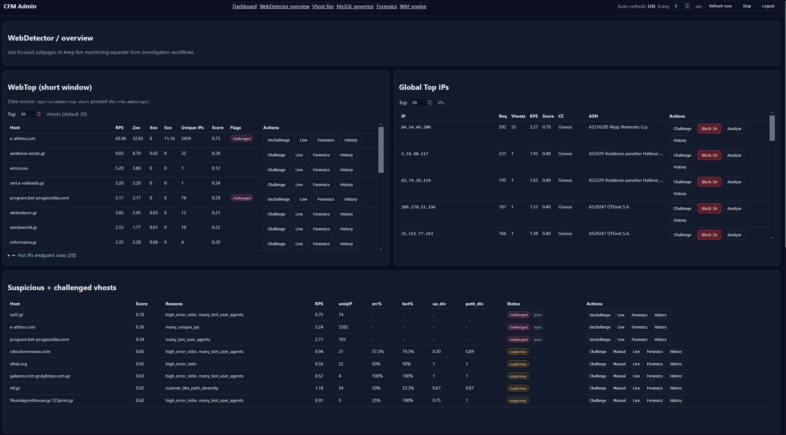
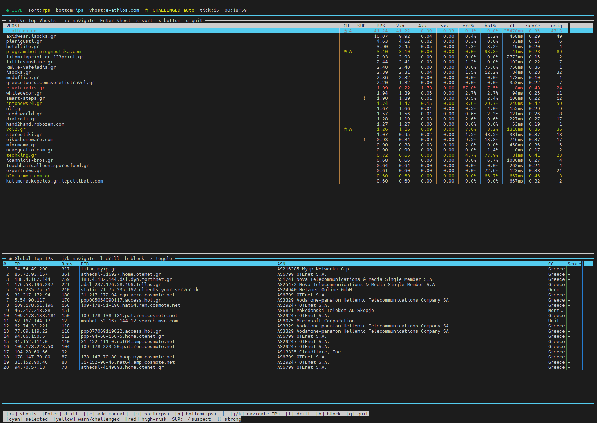
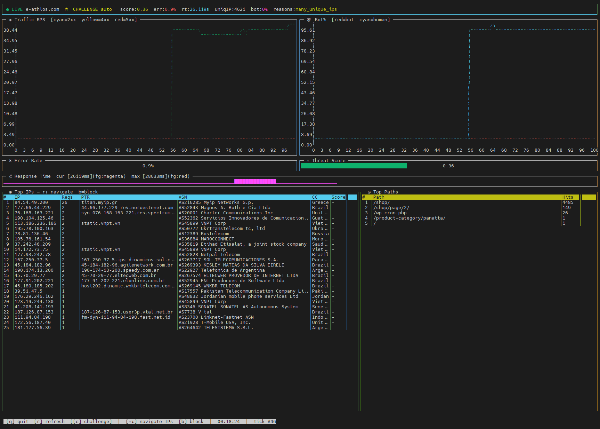
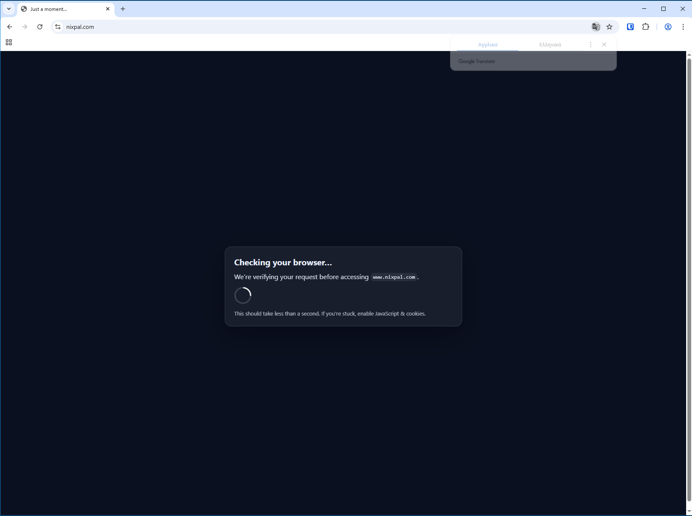
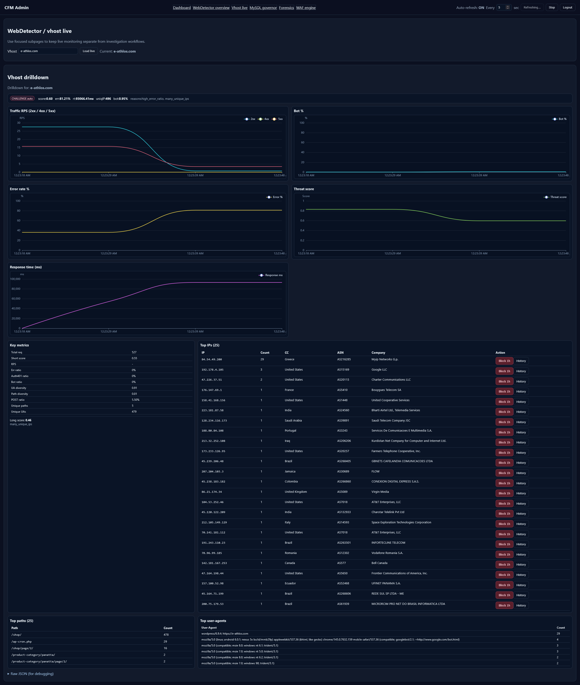
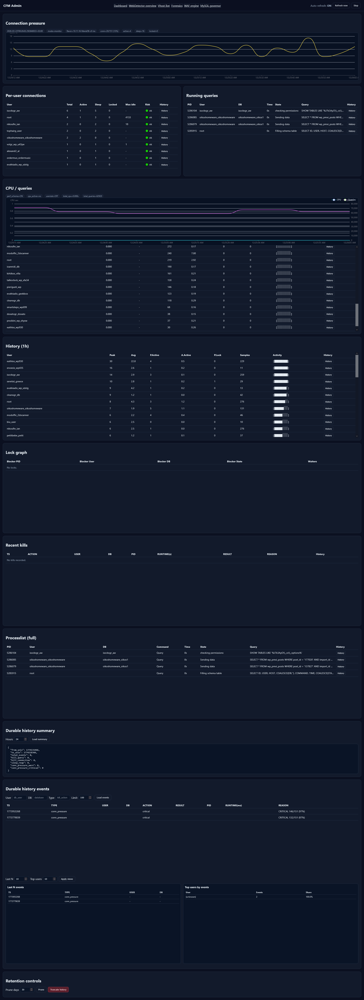
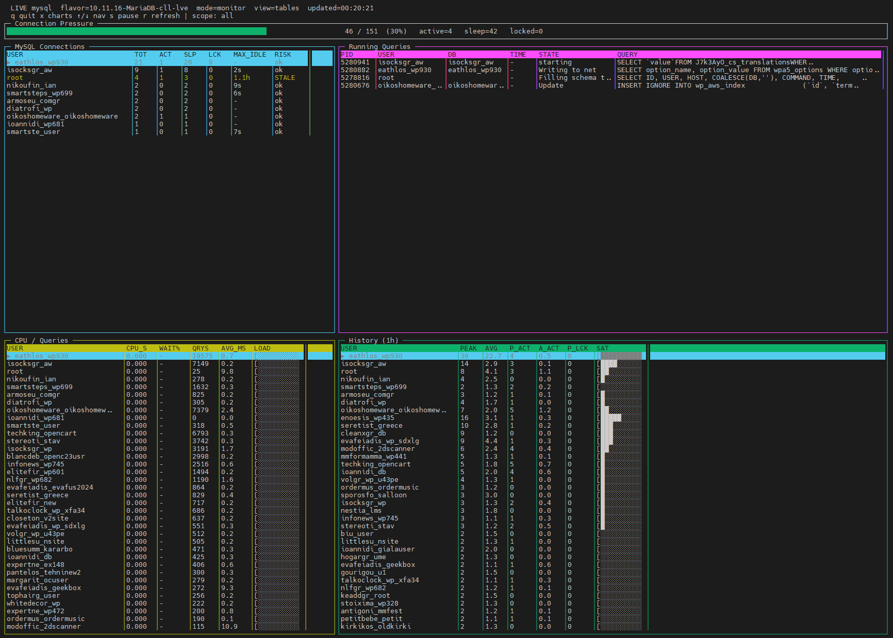

# CFM – Configurable Firewall Manager
<p align="center">
  <b>L3–L7 firewall · WAF · interactive challenge · behavioural BPF LSM detection · KSPP-grade kernel hardening</b><br>
  <i>a single Go daemon, layered defence-in-depth for modern hosting stacks</i>
</p>

<p align="center">
  
</p>

<p align="center">
  
  
  
  
  
  
</p>


CFM is a modern Go-based firewall + detection + mitigation daemon that
spans **five defence layers from the HTTP edge down to the kernel
surface**, all driven from one binary.

At the request edge it combines **nftables policy enforcement**,
**log-driven detectors**, enrichment, notifications, and an
**HTTP challenge engine** that can be enforced either via nftables
redirect/DNAT or directly in-path through a decision socket read from
an edge proxy.

Beyond the request path, CFM ships two kernel-adjacent layers that
catch what the HTTP / log layers structurally cannot see:

- **cfm-lsm** — a BPF LSM subsystem (CO-RE BPF programs, no kernel
  module, no DKMS, no clang on the customer host) that watches
  userspace behaviour at the syscall boundary and catches
  post-exploit patterns like memfd-backed shellcode exec and
  reverse-shell fd patterns. Programs pin to bpffs so detection
  survives daemon restarts.
- **kernsec** — a preemptive kernel-surface hardener that applies
  **KSPP-derived sysctls, boot-arg policies, mount-option audits,
  and module blacklists** so an attacker who lands has less to
  pivot through. Tier-able, fully reversible, with safety preview
  before apply.

The in-path edge proxy can be either **OpenResty** (the original/default) or **Angie**
(an nginx fork by former nginx core developers, supported as of CFM 1.0+). Either one
works as an Edge Interceptor filtering all traffic; the CFM daemon, Lua decision files,
and sslcollector socket are identical for both. See [Section 8](#8-in-path-mode-openresty--angie)
for the trade-offs and how to choose.

> More information: https://infected.gr/category/cfm/

---

## Table of Contents

1. [What is CFM?](#1-what-is-cfm)
   - [Defence-in-Depth Layers](#defence-in-depth-layers)
2. [Installation](#2-installation)
   - [Web UI quick start (recommended)](#web-ui-quick-start-recommended)
3. [Repository Layout](#3-repository-layout)
4. [Configuration Files](#4-configuration-files)
5. [Key Features](#5-key-features)
   - [Firewall Core](#-firewall-core)
   - [Connection Protections](#-connection-protections)
   - [Detection Engine](#-detection-engine)
   - [Autoblock Engine](#-autoblock-engine)
   - [Outbound Abuse Sentinel](#-outbound-abuse-sentinel)
6. [Web Detector](#6-web-detector)
   - [Ingestion Modes](#ingestion-modes)
   - [Log Line Format](#log-line-format-tsv)
   - [Configuration Examples](#configuration-examples)
   - [Hard-Block Triggers](#web-abuse-hard-block-triggers)
   - [Suspicious Scoring](#suspicious-scoring)
7. [Challenge System](#7-challenge-system)
   - [Challenge Serving](#challenge-serving)
   - [Challenge Triggers](#challenge-triggers)
   - [Challenge Abuse Protection](#challenge-abuse-protection)
8. [In-Path Mode (OpenResty / Angie)](#8-in-path-mode-openresty--angie)
   - [Architecture](#architecture)
   - [OpenResty vs Angie — choosing a backend](#openresty-vs-angie--choosing-a-backend)
   - [Smart Lua WAF Layer](#smart-lua-waf-layer)
   - [Advanced Challenge Rules](#advanced-challenge-rules)
   - [Site Cache (per-vhost edge caching)](#site-cache-per-vhost-edge-caching)
   - [Full WAF rule pipeline → §9](#9-web-application-firewall-waf)
9. [Web Application Firewall (WAF)](#9-web-application-firewall-waf)
    - [What it catches](#what-it-catches)
    - [Operator features](#operator-features)
    - [Strengths and trade-offs](#strengths-and-trade-offs)
    - [Tuning workflow](#tuning-workflow)
10. [SSLCollector](#10-sslcollector)
11. [MySQL Governor](#11-mysql-governor)
    - [Overview](#overview)
    - [MySQL Grants](#mysql-grants)
    - [Operating Modes](#operating-modes)
    - [Dedicated Log Channel](#dedicated-log-channel)
    - [Connection Pressure](#connection-pressure)
    - [Lock Fan-out Kill](#lock-fan-out-kill)
    - [Query Rules — QUERY_RULES](#query-rules--query_rules)
    - [Connection Limit Rules — CONN_RULES](#connection-limit-rules--conn_rules)
    - [Sleep Reaper](#sleep-reaper)
    - [Kill Rate Limiting](#kill-rate-limiting)
    - [CPU and Performance Tracking](#cpu-and-performance-tracking)
    - [CLI Reference — cfm mysqltop](#cli-reference--cfm-mysqltop)
    - [HTTP API](#http-api)
    - [Full detectors.conf Example](#full-detectorsconf-example)
12. [Kernel Hardening — `cfm kernsec`](#12-kernel-hardening--cfm-kernsec)
    - [What it manages](#what-it-manages)
    - [Tier model](#tier-model)
    - [How rules reinforce each other](#how-rules-reinforce-each-other)
13. [BPF LSM — `cfm-lsm`](#13-bpf-lsm--cfm-lsm)
    - [What it catches](#what-it-catches)
    - [Modes and the two-process model](#modes-and-the-two-process-model)
    - [Watched-uid model](#watched-uid-model)
    - [How policies stack](#how-policies-stack)
    - [How kernsec and cfm-lsm complement each other](#how-kernsec-and-cfm-lsm-complement-each-other)
14. [CLI Reference – `cfm webtop`](#14-cli-reference--cfm-webtop)
    - [CLI Reference – `cfm bots`](#cli-reference--cfm-bots)
15. [Web Detector HTTP API](#15-web-detector-http-api)
16. [Security Notes](#16-security-notes)

---

## 1. What is CFM?

CFM is a **unified L3–L7 enforcement platform** — a single Go binary with a direct nftables
backend and no iptables dependency.

| Layer | Function |
|---|---|
| L3/L4 | Firewall, IDS/IPS, connection/rate limiting, system hardening |
| L7 | Behavioral Web Detection, OWASP-inspired WAF, Interactive Challenge Engine |
| MySQL | Processlist governor, runaway query kill, connection-limit enforcement |
| Support | Enrichment (PTR / ASN / Country), TLS-aware smart bridge, notifications |


**What makes it unique:**
- Single Go binary, low footprint
- Direct nftables backend (no iptables dependency)
- Broad detector coverage: SSH, Exim, Dovecot, FTP, MySQL, cPanel, ModSecurity, Web
- Web Detector that can escalate to an **interactive challenge** instead of always hard-blocking
- MySQL Governor that can kill runaway queries and enforce per-user connection limits
- **Outbound Abuse Sentinel** — per-uid detection of SMTP bursts, scanner activity, HTTP fan-out and DNS amplification before your IPs land on blacklists
- ML-Ready: the scoring system is a hand-crafted classifier based on trusted signals

### Defence-in-Depth Layers

CFM is not one monolithic blocker — it is a stack of **five
independent layers**, each looking at the host from a different
angle. They do not duplicate each other; each catches the threats
the others structurally cannot see. A live attack typically
traverses every one of them, and every one of them ships from a
single daemon binary plus an optional edge proxy.

```
        incoming request / login / connection / abuse signal
                                  ↓
┌─────────────────────────────────────────────────────────────────┐
│  [1] CHALLENGE ENGINE        interactive proof-of-work          │
│      (request edge)          + browser/bot fingerprinting       │
└─────────────────────────────────────────────────────────────────┘
                                  ↓
┌─────────────────────────────────────────────────────────────────┐
│  [2] WAF                     OpenResty/Angie Lua rule layer     │
│      (in-path)               + ModSecurity integration          │
└─────────────────────────────────────────────────────────────────┘
                                  ↓
┌─────────────────────────────────────────────────────────────────┐
│  [3] DETECTORS + WEBDET.     log-driven, per-protocol           │
│      (post-fact)             SSH / mail / FTP / panel / WAF     │
└─────────────────────────────────────────────────────────────────┘
                                  ↓
┌─────────────────────────────────────────────────────────────────┐
│  [4] cfm-lsm (BPF LSM)       userspace behavioural enforcement  │
│      (runtime kernel hook)   memfd exec, reverse shell pattern  │
└─────────────────────────────────────────────────────────────────┘
                                  ↓
┌─────────────────────────────────────────────────────────────────┐
│  [5] kernsec                 KSPP-grade preemptive hardening    │
│      (boot-time + runtime)   sysctls, boot args, modules, mount │
└─────────────────────────────────────────────────────────────────┘
```

**How the layers pair.** Each can act on its own, but together
they form a chain — earlier layers shed the easy attacks; later
layers backstop the leaks.

#### [1] **Challenge Engine** — *make the abuser prove they are a real user*

The first checkpoint for any request that triggered a soft signal
(suspicious country, high request rate, missing browser
fingerprint). Issues an interactive cookie/JS challenge via
nftables DNAT or directly in-path through the edge proxy. Costs
the operator nothing if the visitor is legitimate; blocks the
flow entirely if it is a script. Tunable per-vhost and per-rule;
see [Section 7](#7-challenge-system). Provides clean separation
between **"definitely block"** and **"probably suspicious but let
the user prove themselves"** — which keeps false-positive rates
liveable on real hosting traffic.

#### [2] **WAF** — *block known attack signatures before they reach the app*

The OpenResty / Angie in-path layer runs a fast Lua rule pipeline —
**66 detectors across 9 rule-ID groups (1xx-9xx)** with severity
aggregation and per-rule modes (`disabled / logonly / challenge /
block`). Inspects URI, query, body (per-Content-Type budget up to
32K JSON) and headers for SQLi, XSS, RFI, command injection,
PHP wrappers, **Log4Shell + evasion variants**, Java
deserialization, shell-upload paths, polyglot uploads, reverse
shells, persistence markers, LOLbins, C2 paste tunnels, coinminer
URLs, **bad UTF-8 encoding**, plus bad-UA scoring. Decisions feed
back into the daemon's allow/block sets and into the challenge
layer (suspicious requests get challenged instead of hard-blocked,
where appropriate). Per-vhost rule exclusions and a `cfm webtop
waf hit-rates` operator workflow let you tune from production
traffic instead of guessing. See [Section 9](#9-web-application-firewall-waf)
for the full pipeline; [Section 8](#8-in-path-mode-openresty--angie)
for the OpenResty / Angie deploy choices.

#### [3] **Detectors + webdetector** — *post-fact log intelligence*

Twelve+ protocol-specific detectors (SSH, Exim, Dovecot, FTP,
MySQL, MySQL Governor, cPanel, ModSec, postfix, health,
webdetector) read live from server logs, score events, and feed
the autoblock engine with timed bans. Webdetector additionally
correlates HTTP requests over time per vhost (suspicious-path
hits, scanner cadence, repeat-offender patterns) and can escalate
to challenge or hard-block. This is the layer that catches
brute-force, distributed scanning, and pattern abuse that the
WAF / challenge layers individually cannot — they only see one
request at a time; detectors see the campaign.

#### [4] **cfm-lsm (BPF LSM)** — *catch the post-exploit cash-in*

When request-layer defences miss and code is running, cfm-lsm
takes over. BPF LSM programs (CO-RE; no kernel module; no DKMS)
hook `bprm_check_security` and observe userspace behaviour at the
syscall boundary. It catches the **consequence** of any successful
compromise — including kernel 0-days — that no log line ever
shows: a PHP-FPM worker spawning a process from a `memfd_create`
payload (the canonical fileless-malware pattern), or a process
exec'ing with stdin/stdout/stderr dup'd onto a connected remote
TCP socket (the reverse-shell fingerprint). BPF programs pin to
`/sys/fs/bpf/cfm/` via `cfm lsm enable`, so kernel-side detection
**survives daemon restarts and crashes** — the daemon's role
becomes "drain events into the notify pipeline," not "keep
protection alive." See [`docs/cfm-lsm.md`](docs/cfm-lsm.md).

#### [5] **kernsec** — *preemptive kernel-surface reduction*

The bottom layer is also the earliest one in time: kernsec applies
**KSPP-derived sysctls** (`kernel.yama.ptrace_scope`,
`kernel.kptr_restrict`, `kernel.dmesg_restrict`,
`kernel.unprivileged_bpf_disabled`, ASLR, panic-on-oops, etc.),
**boot-arg policies** (`slab_nomerge`, `init_on_alloc=1`,
`page_alloc.shuffle=1`, `randomize_kstack_offset=on`, `tsx=off`,
`oops=panic`, plus `lsm=…` ordering), **module blacklists** for
risky legacy kernel modules, and a **mount-option audit**
covering `noexec` / `nosuid` / `nodev` on `/tmp`, `/var/tmp`,
`/dev/shm`, `/home`. Tier-based (Tier 1 safe-everywhere; Tier 2
opt-in stricter), fully reversible via `cfm kernsec rollback`,
with a safety preview before any apply. It is the hardening that
shapes the host *before* any attack arrives, so even a
successful userspace foothold has less to pivot through. See
[`docs/kernsec.md`](docs/kernsec.md).

**Two-process model for cfm-lsm.** Unlike the other layers,
cfm-lsm separates *protection* (kernel-side, lives independent of
userspace) from *event collection* (cfm daemon, drains the
ringbuf into the notify pipeline). After `cfm lsm enable`, the
BPF programs stay attached even with `systemctl stop cfm` — block
decisions happen inside the kernel. The daemon's role is to ship
events out; not to keep cfm-lsm alive. See
[`docs/cfm-lsm.md`](docs/cfm-lsm.md) → "Two-process model" for the
full picture.

**Read order:**

- [`docs/cfm-lsm.md`](docs/cfm-lsm.md) — **BPF LSM userspace-
  behaviour enforcement** (two-policy MVP, six-step preflight,
  pin-to-bpffs lifetime, daemon adoption, plus detailed design
  for the next two policies CFML-FS-005 / CFML-CRED-002).
- [`docs/kernsec.md`](docs/kernsec.md) — **kernel-surface
  reduction** (sysctls, boot args, modules, mounts, host-profile
  gates, intentional non-overlap with cfm-lsm).
- [`docs/DETECTORS.md`](docs/DETECTORS.md) — protocol-layer
  detectors and per-section block policy.

**Status.** All five layers are shipping. Challenge, WAF,
detectors, webdetector, and `kernsec` are production-mature.
`cfm-lsm` is **MVP-shipping in monitor mode** — both BPF programs
(CFML-EXEC-001 memfd exec, CFML-EXEC-003 reverse-shell pattern)
verified to load on EL10 (kernel 6.12), Debian 12+, Ubuntu 22.04+.
**RHEL 9 / CL9 stock kernels are unsupported** because they ship
without `CONFIG_BPF_LSM=y`; `cfm lsm status` reports this
specifically with remediation guidance. Enforce-mode flip waits
on 30-day FP telemetry.

**Quick start for the bottom two layers:**

```bash
# Kernel hardening (preemptive, kernsec)
cfm kernsec status              # audit current host
cfm kernsec preview             # what `apply` would change
cfm kernsec apply               # write sysctls + boot args, refresh bootloader
cfm kernsec monitor enable      # periodic drift-check systemd timer

# BPF LSM (runtime, cfm-lsm)
cfm lsm status                  # kernel preflight + state
cfm lsm probe                   # verify the kernel accepts attach (detaches)
cfm lsm enable                  # load + pin (persists past daemon restart)
systemctl restart cfm           # daemon adopts pinned state, drains events
cfm lsm disable                 # turn off + unpin
```

---

## 2. Installation

Ready-to-run packages are available for Debian and EL (AlmaLinux / Rocky / CloudLinux).

### Debian
```bash
wget -qO - https://repo.nixpal.com/debian/nixpal-repo.gpg | gpg --dearmor -o /etc/apt/trusted.gpg.d/nixpal-repo.gpg
wget https://repo.nixpal.com/debian/nixpal.list -O /etc/apt/sources.list.d/nixpal.list
apt update && apt install cfm
```

### EL (AlmaLinux / Rocky / CloudLinux)
```bash
dnf install https://repo.nixpal.com/el/nixpal.rpm
dnf install cfm
```

Both packages create the `cfm` system user and group automatically during installation.

### Web UI quick start (recommended)

Start with `cfm auth`, then log in to `/cfm-admin` and configure Notifier from UI.

1. Notifier now includes a Web UI for channels, routing, templates/dedupe, test send, history, and backups/restore.
2. First-time setup: run `cfm auth` initialization and create a login-capable user.
3. Login entry paths:
   - direct API port: `http(s)://<server>:<API_PORT>/cfm-admin`
   - via OpenResty/Angie interceptor: `http(s)://<hostname>/cfm-admin`
4. These paths serve the same UI and authentication flow.

#### Roadmap

**Available now**
- **Notifier Web UI** is production-ready in `/cfm-admin` for channel management, routing, templates/dedupe, test send, history, and backup/restore.
- **Detectors Settings UI** is live at `/cfm-admin/detectors/` with safe draft validation, diff preview, backup/restore, and reload hooks.
- **Verification anchors:** frontend implementation is under `internal/webui/static/detectors/`; backend detector settings endpoints are implemented in `internal/apiserver/detectors_api.go`.

**Planned**
- Expand detector-form coverage for additional advanced `webdetector` keys and modeling controls that are not yet represented in the current detectors UI.

### Manual install (from source)

If you build from source and install without the package manager, create the system account first:

```bash
groupadd --system cfm
useradd --system --gid cfm --no-create-home \
        --home-dir /var/lib/cfm --shell /sbin/nologin \
        --comment "CFM service account" cfm
```

The `cfm` group is required for the SSLCollector unix socket and token file to be readable by OpenResty/Angie workers. The cfm daemon logs a warning at startup if the group is missing and the socket server is enabled.

#### Build-time dependencies

**Default `go build` — no new tools.** The standard build path is
`make build` / `go build` with `CGO_ENABLED=0`. It does not need
clang, libbpf-dev, or kernel headers. cfm-lsm's BPF objects are
**pre-compiled and committed** to the repo as `.o` files; `go build`
embeds them via `go:embed`. End users, distro packagers, and CI all
work with stock Go.

**Contributors who change BPF C — additional tools.** Only required
when editing files under `internal/lsm/bpf/*.bpf.c` (or the shared
`vmlinux.h` / `common.bpf.h`). To regenerate the BPF objects after
such a change:

| Tool | Version | Used for |
|---|---|---|
| `clang` | ≥ 11 (12+ recommended; EL10 ships `clang18`) | Compiles the BPF C sources via `go generate` |
| `libbpf-dev` (Debian/Ubuntu) / `libbpf-devel` (EL) | ≥ 0.8 | Provides `<bpf/bpf_helpers.h>` and friends |
| `bpftool` | ≥ 5.10 | Optional — only needed to regenerate `vmlinux.h` from a real `/sys/kernel/btf/vmlinux`. The MVP ships a hand-written minimal `vmlinux.h` so `bpftool` is not in the critical path. |

Regenerate with:

```bash
# Debian / Ubuntu
apt install clang libbpf-dev linux-tools-common

# RHEL 10 / Alma 10 / Rocky 10 / CentOS Stream 10
#   libbpf-devel lives in CRB (CodeReady Builder); clang18 lives in EPEL.
dnf install epel-release
dnf config-manager --set-enabled crb
dnf install clang18 libbpf-devel bpftool

# RHEL 9 / Alma 9 / Rocky 9 / CentOS Stream 9 (contributors only;
#   note that EL9 stock kernels do NOT ship CONFIG_BPF_LSM=y, so the
#   compiled object only runs on EL10+/Debian 12+/Ubuntu 22.04+ —
#   but EL9 is fine as a build environment if that's what you have)
dnf install epel-release
dnf config-manager --set-enabled crb
dnf install clang libbpf-devel bpftool

# Regenerate (any distro)
go generate ./internal/lsm/...
git add internal/lsm/cfmlsm_*_bpfel.{go,o}
```

The four generated artifacts
(`cfmlsm_x86_bpfel.{go,o}`, `cfmlsm_arm64_bpfel.{go,o}`) are
committed alongside the BPF C sources. Reviewers can sanity-check
that a `go generate` against the same `clang` version produces a
matching diff.

**Runtime, not build-time.** Loading the compiled BPF programs at
runtime needs `CONFIG_BPF_LSM=y`, `bpf` listed in
`/sys/kernel/security/lsm`, a `/sys/kernel/btf/vmlinux` BTF, and
`CAP_BPF` + `CAP_PERFMON` (or `CAP_SYS_ADMIN`). Run `cfm lsm status`
to audit fleet readiness — see [`docs/cfm-lsm.md`](docs/cfm-lsm.md)
for the full preflight detail.

### nftlib-only deployment requirement clarity

For `CFM_FIREWALL_ENGINE=nftlib`, blocks, allows, blocklist feeds and the DNAT redirect tables are written over netlink, with no fork. Structured inspection (`ListTableJSON`, `ListSetJSON`) is also native.

The `nft` binary must still be present on the host. The self and port sets and the input-chain rules are written with it: the ports policy and the scoped DNAT accepts (web and cPanel). google/nftables v0.3.0 cannot read back a `ct original …` match, which every DNAT accept carries, so these are managed as nft text (`internal/firewall/panel_dnat_accepts.go`). The two text-inspection diagnostics (`ListTableTextNoDNS`, `ListChainText`) also run it.

The engine comes from the `CFM_FIREWALL_ENGINE` line in `cfm.conf` (`FIREWALL_ENGINE` is read too; both set the same value and the later line wins, so edit the existing line rather than adding another). The daemon and the `cfm` CLI resolve it the same way, so CLI commands run on the same backend as the daemon; restart the daemon after changing it. The `CFM_FIREWALL_ENGINE` environment variable overrides the file for the one process it is set in, so don't set it with `systemctl set-environment`: the CLI would not see it.

---

## 3. Repository Layout

CFM ships **reference configs** under `configs/` (packaged to `/usr/share/cfm/configs/`) and
**live configs** under `/etc/cfm/`.

```text
  configs/
  cfm.conf                  # main daemon config (ports policy, nft, sysctl, maxmind, api, logs)
  detectors.conf            # detectors + thresholds + per-section BLOCK policies
  notify.conf               # notifier channels + dedupe + per-detector routing
  cfm.blocklists            # external feed definitions (ALLOW/BLOCK, refresh interval, etc.)
  cfm.allow / cfm.deny      # static allow/deny lists (IP/CIDR/host)
  cfm.ignore                # IPs that must never be blocked (global ignore list)
  cfm.dyndns                # hostnames resolved periodically and added to allow
  cfm-admin.htpasswd        # optional /cfm-admin BasicAuth file (shipped empty)
  httpd-cfm.conf            # Apache LogFormat for WebDetector TSV
  nginx-cfm.conf            # nginx log_format for WebDetector TSV
  sslcollector.lua          # Lua helper for dynamic cert loading (OpenResty/Angie, via unix socket)
  trusted_proxies.conf      # real_ip / trusted proxy include for Cloudflare/LB setups
  openresty.conf            # full OpenResty "in-path WAF/challenge" config
  angie.conf                # Angie equivalent of openresty.conf (for boxes where Angie is used instead)
  webdetector_*.txt         # webdetector path lists: challenge_paths, malpaths, exclude, etc.
  
  internal/webui/embed.go   # embeds admin UI assets into the Go binary
  internal/webui/static/    # embedded /cfm-admin UI pages and assets
    detectors/              # detectors UI page
    settings/               # settings UI page
    webdetector/            # webdetector pages (overview, controls, forensics, vhost, waf)
  docs/cfm-admin-webtop.md  # deployment/auth notes for embedded /cfm-admin UI
packaging/
  debian/DEBIAN/*           # postinst/prerm/postrm, conffiles, etc.
  rpm/SPECS/cfm.spec
internal/
  detectors/                # ssh/mysql/ftp/exim/dovecot/cpanel/webdetector/modsec/health/postfix...
  notify/                   # notifier engine (sendmail/smtp/slack), dedupe, templates
  firewall/
    nft/                    # exec-based nftables backend (default; CFM_FIREWALL_ENGINE=nft)
    nftlib/                 # netlink backend, zero-fork (CFM_FIREWALL_ENGINE=nftlib)
    autoblock/              # engine-neutral sliding-window auto-block evaluator
    selfip/                 # engine-neutral local-interface IP resolver
  sslcollector/             # cert discovery + socket API for OpenResty/Angie
```

---

## 4. Configuration Files

### `cfm.conf` — Main daemon config
- Ports policy: `TCP_IN`, `UDP_IN`, `TCP_OUT`, `UDP_OUT`
- nftables hook ordering: `NFT_INPUT_PRIORITY`
- Connection protections: `CONNLIMIT`, `PORTFLOOD`, `PKT_RATE/PKT_BURST`, `NEW_RATE/NEW_BURST`, `ICMP_*`
- Throttle-to-autoblock glue: `THROTTLE_*`
- Portscan tracking: `PS_*`
- MaxMind updater: `MAXMIND_*`
- **Why MMDB is critical**
  - MMDB databases are shared across CFM enrichment pipelines and power IP→country/ASN lookups used by detection, reporting, and automation flows.
  - The same MMDB data is also used by OpenResty/Angie integrations for country-aware location and filtering decisions.
- **Download source selection** (deterministic order)
  1. If both `MAXMIND_ACCOUNT_ID` and `MAXMIND_LICENSE_KEY` are set, CFM uses MaxMind GeoLite2 sources.
  2. Otherwise, CFM fetches open MMDB files from IPLocate GitHub raw URLs:
     - `https://github.com/iplocate/ip-address-databases/raw/refs/heads/main/ip-to-asn/ip-to-asn.mmdb`
     - `https://github.com/iplocate/ip-address-databases/raw/refs/heads/main/ip-to-country/ip-to-country.mmdb`
- **Canonical on-disk filenames**
  - CFM expects MMDB files to be present as `GeoLite2-ASN.mmdb` and `GeoLite2-City.mmdb`.
  - When fallback IPLocate sources are used, downloaded files are mapped/renamed to these canonical filenames on disk.
  - IPLocate's files keep their own FLAT schema under those names (`asn` — a
    string —, `org`, `country_code`, `country_name`; no city), not MaxMind's
    nested one. Both readers handle either schema: the daemon's enricher
    (`internal/enrich/geodb.go`) and the edge's `cfm_geo.lua`. Earlier
    releases read neither, so a node on IPLocate had no country or ASN
    anywhere. City names are empty on IPLocate (the free database has none).
- API integration: `API_URL`, `AUTH_TOKEN`, `*_SEND_TO_API`
  - `AUTH_TOKEN` is **mandatory** when the internal API server is enabled (`PORT > 0` or `TLS_PORT > 0`) because privileged API routes require it.
  - API ports must stay firewalled by default (`PORT` usually `6060` plaintext and `TLS_PORT` usually `6061`) and should only be reachable from localhost or explicitly allowed sources (for example entries resolved from `cfm.allow` / `cfm.dyndns`).
  - When `API_URL` is configured, its destination IP is auto-added to the allow set so API callbacks still work with strict firewalling.
- Web-auth defaults (from `configs/cfm.conf` template):
  ```ini
  AUTH_DB_PATH = "/var/lib/cfm/auth.db"
  AUTH_SESSION_DB_PATH = "/var/lib/cfm/auth-sessions.db"
  AUTH_MFA_ENCRYPTION_KEY = ""
  AUTH_MFA_LOGIN_VERIFY_ENABLED = true
  AUTH_MFA_TOTP_ENROLL_ENABLED = false
  AUTH_MFA_TOTP_PILOT_USERS = ""
  AUTH_SESSION_TTL = "8h"
  AUTH_SECURE_COOKIE = 0
  AUTH_COOKIE_NAME = "cfm-sid"
  ```
- Debug server: `LISTEN_ADDRESS`, `PORT`
- MySQL governor log: `MYSQL_LOG_STDOUT`, `MYSQL_LOG_FILE`

### `detectors.conf` — Detection engine
- `[global]` defaults: `DEFAULT_EVERY`, `DEFAULT_TIMEOUT`, `DEFAULT_COOLDOWN`
- Global ignores: `IGNORE_IPS`, `IGNORE_NETS`, `LOG_IGNORED`
  - When panel routes use the shared `cfm_challenge` backend (`127.0.0.1:9098`), these global ignore lists affect both web and panel challenge decisions.
- Per-detector sections: `[cfm_endpoints]`, `[ssh_auth]`, `[mysql]`, `[mysql_governor]`, `[ftpd]`, `[cpanel]`, `[exim_*]`, `[dovecot_*]`, `[postfix_*]`, `[modsec]`, `[health]`, `[webdetector]`
- CFM control-plane detector: `[cfm_endpoints]` (default-on even when the section is absent; apiserver auth/probe anomalies with staged observe/challenge/TTL-block mitigation). The old `[api_abuse]` name is a deprecated compatibility alias.
- Webdetector history knobs live in `[webdetector]` here (not in `cfm.conf`): `HISTORY_ENABLED`, `HISTORY_DB_PATH`, `HISTORY_RETENTION_DAYS`, `HISTORY_PRUNE_EVERY`
- Per-section block policy: `BLOCK = no|dryrun|permanent|<duration>` + `BLOCK_COOLDOWN`

### Detectors

CFM detector runtime config lives at **`/etc/cfm/detectors.conf`** (packaged baseline: `configs/detectors.conf`).

- Inline detector examples and templates: [`configs/detectors.conf`](configs/detectors.conf)
- Detector model, built-ins, and custom detector how-to: [`docs/DETECTORS.md`](docs/DETECTORS.md)
- Leniency tuning and `.leniency` companion sections: [`docs/DETECTORS.md` §6](docs/DETECTORS.md#6-leniency-companion-sections)

Capabilities at a glance:
- Built-in detectors for CFM's own control plane, SSH, mail, FTP, MySQL, cPanel, ModSecurity, health, and web traffic.
- Per-section block modes: `off`/`no`, `dryrun`, `permanent`, or duration TTL (for example `30m`, `2h`).
- Multiple log sources by detector: `file`, `journal`, and `docker` where supported.
- Custom regex detectors via `[custom:<name>]` sections (and expanding UI support as it becomes available).

> **Start safe:** set `BLOCK = dryrun` while tuning thresholds, regexes, and ignore lists; switch to TTL or `permanent` only after validation.

#### CFM endpoint protection guidance
- Protection is built in and default-on; an optional `[cfm_endpoints]` section overrides the built-in values. Use an explicit `ENABLED=0` only when intentionally opting out.
- With no readable `detectors.conf`, stage 1 and the stage-3 TTL policy remain
  available, but stage-2 challenge requires the webdetector bridge and therefore
  records a failed challenge until the normal config loads. A first-load read
  error retries regular detectors automatically; restart after recovery to
  reapply start-once config consumers such as the MySQL governor.
- The built-in thresholds intentionally treat 10 direct invalid-token events in
  two minutes as observe, 12 as challenge, and 16 as a 15-minute TTL-block
  candidate. A stale automation token can reach those thresholds quickly.
- Before rollout, inspect control-plane traffic for uptime monitors and trusted
  automation, then add only their stable addresses to `[global]`
  `IGNORE_IPS`/`IGNORE_NETS` (avoid broad shared-cloud ranges). Start the first
  week with `[cfm_endpoints]` `BLOCK = dryrun` or `BLOCK = no` while validating
  the baseline; section-policy `dryrun` covers both challenge and block stages.
- The edge deliberately replaces control-plane XFF with one normalized client
  address. If another reverse proxy sits in front, add only that proxy to the
  edge real-IP trust configuration; the original multi-hop XFF chain is not
  retained for later attribution.
- Enable gradual mitigation next: keep stage 1 as observe, set `STAGE2_THRESHOLD` + `STAGE2_CHALLENGE_TTL` for temporary challenge responses.
- Enable stage 3 only after baseline tuning: set `BLOCK = <short ttl>` (or `BLOCK=dryrun` first), then tune `STAGE3_THRESHOLD` and `BLOCK_COOLDOWN`.
- Prefer `[global]` `IGNORE_IPS`/`IGNORE_NETS` or section `ALLOW_IPS`/`ALLOW_NETS`
  for trusted monitors and proxies; these are discarded before detector counting.
  `ALLOW_UA_CONTAINS` is attacker-controlled; the historical shipped
  `uptime,healthcheck,prometheus` list is removed on load unless retaining that
  exact list is acknowledged with `ALLOW_UA_CONTAINS_EXPLICIT=1`. Use
  `PATH_EXCEPTIONS` only suppresses generic unauthorized-burst noise on an
  exact path; direct auth failures, fuzz and method probes still count.

### `notify.conf` — Notifier
- Global on/off + JSONL audit log
- Dedupe keying: `[dedupe]`
- Channels: `sendmail`, `smtp`, `slack_webhook`
- Per-detector routing + severity gating: `[detector "..."]`

### `cfm.blocklists` — External feed pulls
Defines scheduled pulls of external feeds into allow/block sets.

### `cfm.dyndns` — Dynamic DNS allow
Hostnames periodically resolved and kept in the allow set (e.g. dynamic office IPs).

### Web log format snippets (`httpd-cfm.conf`, `nginx-cfm.conf`)
Ensures WebDetector sees a consistent TSV schema across stacks.

### Malformed request logging (OpenResty / Angie)
- In `configs/openresty.conf` and `configs/angie.conf`, malformed/empty request
  traffic is routed to `access.bad_request.log` (not the main `access.log` cfm
  format).
- The `cfm_bad_request` log format uses escaped output (`escape=json`) so
  control bytes are rendered safely for storage and parsing.
- When investigating these lines, prefer byte-aware viewers/parsers that
  preserve escaped sequences (for example: `jq -Rr .`, `python -m json.tool`,
  or SIEM/raw viewers that do not auto-unescape).


---

## 5. Key Features

### 🔒 Firewall Core
- Two independent firewall backends, selected by the `CFM_FIREWALL_ENGINE` line in `cfm.conf` (the environment variable of the same name overrides it). The daemon and the CLI both follow it:
  - `nft` (default) — exec-based nftables backend; no extra Go dependencies
  - `nftlib` — netlink backend (`github.com/google/nftables`); zero-fork block, allow and feed writes, which eliminates the fork-storm risk on large feed updates; set `CFM_FIREWALL_ENGINE = "nftlib"` to enable
- Auto-created `inet cfm` table/chains (idempotent on every daemon start)
- Hook priority control (`NFT_INPUT_PRIORITY`) to run before/after other stacks (CSF/Imunify)
- ALLOW/BLOCK sets (v4/v6) + dynamic allow via hostname/DynDNS resolution
- Port policy from config (`TCP_IN`, `UDP_IN`, etc.)
- SMTP_BLOCK mode (CSF-compatible pattern)

### ⚡ Connection Protections
- ConnLimit per port (concurrent connections per IP)
- PortFlood per port (new connection rate limits per IP)
- PPS limits: `PKT_RATE`, `PKT_BURST`, `PKT_MODE`
- New connection rate limiting: `NEW_RATE`, `NEW_BURST`
- ICMP rate limiting
- Bad TCP flag filtering (NULL / XMAS / SYN+FIN)

### 🔎 Detection Engine
Detectors parse logs/metrics to spot abuse:
- Exim (queues, auth failures, relay abuse)
- SSH (auth fails, brute force)
- Dovecot (auth fails)
- FTP (pure-ftpd / proftpd / vsftpd)
- cPanel logins
- MySQL denied / scanner attempts
- ModSecurity alerts
- Health detector (CPU / RAM / disk / SMART / RAID / ZFS / conntrack spikes)
- **MySQL Governor** (processlist monitor, runaway query kill, connection-limit enforcement — see [§11](#11-mysql-governor))
- **Web Detector** (see [§6](#6-web-detector))

### 🚨 Autoblock Engine
- Inserts IPs into nftables sets (TTL or permanent)
- Per-detector policies: `dryrun`, `ttl=1h`, `permanent`
- Dedupe suppression for noisy repeats (`host|kind|ip|reason`)
- Unified reasons: `SSH_BRUTE`, `PORTSCAN`, `CONNLIMIT`, `WEB_*`, etc.

### 📤 Outbound Abuse Sentinel

A direct counterpart to the inbound detection engine: instead of asking "who is
attacking us?" it asks "which of my hosted accounts is generating outbound
abuse?" — the question that decides whether your mail IPs end up on Spamhaus,
your egress IP gets nullrouted by your upstream, or a compromised PHP site
turns your server into a botnet node.

**What it does (phase 1 — observe + warn):**
- Watches new outbound TCP connections per Linux uid via NFLOG.
- Classifies each event by destination port group:
  - **SMTP** — outbound 25 / 465 / 587 (mail flood, compromised CMS sending spam)
  - **SCAN** — outbound 22 / 23 / 3389 (brute-forcer / scanner running on your box)
  - **HTTP** — outbound 80 / 443 / 8080 / 8443 (POST flood, botnet C2)
  - **UNIQ_DST** — many distinct destination IPs in the window (horizontal scanner)
- Maintains a per-uid sliding window with per-signal dedup so a runaway
  account doesn't spam the log.
- On threshold trip, writes a single forensic line to `cfm.smtp.log` with the
  user, process, pid, **cwd**, **cmdline**, peer sample, dst-IP enrichment
  (ASN/Country/PTR), and an **exim queue snapshot** (msgids + sender
  addresses) when the signal is SMTP — so the offending script is identifiable
  from one log line.
- For HTTP/HTTPS signals, phase 1 reports destination IP/port samples only. It
  does **not** report the URL, path, or HTTP host because the NFLOG collector
  observes connection metadata, not application request payloads.
- Emits a `notify.Event` (`kind=outbound_abuse`, `section=outbound`,
  `severity=warning`) so existing Slack / email / webhook channels carry it.

**Architecture (observe-only):**
```
nftables OUTPUT chain (cfm_outbound_observe, priority 10)
   ├─ skuid 0 / allowlist → return            (root + system services exempt)
   ├─ ct state new tcp dport {SMTP|SCAN|HTTP} → NFLOG group N
                                                       ↓
                                       internal/outbound/collector.go
                                                       ↓
                                       analyzer (sliding window per uid)
                                                       ↓
                                       alerter → cfm.smtp.log + notify
```

The chain is installed at output priority 10 (after `smtpblock` at -100), so a
packet already being denied by SMTP_BLOCK is never double-logged. Root traffic
is filtered at the **kernel** boundary, not in user space — system mailers and
cfm itself don't waste netlink bandwidth.

**Phase 1 is observe-only.** No throttle, no suspend, no nft rate-limit. The
chain is `policy accept`; if cfm crashes, no outbound traffic is affected.
Phase 2 (planned) will add a sibling `cfm_outbound_enforce` chain with opt-in
per-uid throttle and configurable suspend hook.

**Configuration** (defaults shown — all in `cfm.conf`):
```ini
OUTBOUND_ENABLED                 = 0       # off by default
OUTBOUND_NFLOG                   = 0       # NFLOG group; must differ from SMTP_LOG_NFLOG
OUTBOUND_WINDOW_SECONDS          = 60
OUTBOUND_SMTP_CONN_PER_MIN       = 30
OUTBOUND_SCAN_UNIQUE_DST_PER_MIN = 50
OUTBOUND_HTTP_RATE_PER_MIN       = 200
OUTBOUND_LOG_DEDUP_SECONDS       = 300     # don't re-warn within this window
OUTBOUND_QUEUE_SAMPLES           = 5       # exim msgid/sender lines per warning
OUTBOUND_LOG_ENRICH              = 1       # GeoIP/ASN on destination IP
OUTBOUND_HTTP_ATTRIBUTION_ENABLED = 0       # optional best-effort HTTP attribution; privacy-sensitive
# Auto-exempt (when present): users cfm,mailnull and groups cfm,mail
# OUTBOUND_ALLOW_USERS = mailman,exim      # extra names (resolved at load time)
# OUTBOUND_ALLOW_GROUPS = mailman
# OUTBOUND_ALLOW_UIDS = 8,12               # mailnull / mailman if you see false positives
# OUTBOUND_ALLOW_GIDS = 12
```


**HTTP attribution roadmap (optional, disabled by default):**

The NFLOG collector remains intentionally small and connection-oriented. If an
operator needs richer HTTP attribution than destination IPs, build it as a
separate opt-in component instead of extending the core collector:

- **Cleartext HTTP (`:80`)** — optionally sample the first request bytes and
  extract the `Host` header. Keep samples bounded, avoid storing paths/bodies by
  default, and treat captured request bytes as sensitive data.
- **TLS (`:443`)** — because URLs and paths are encrypted, use best-effort
  correlation instead: match destination IPs with process DNS lookups, collect
  SNI via eBPF/pcap only where available and legally/operationally acceptable,
  or consume proxy logs when CFM controls egress through an HTTP(S) proxy.
- **Operational cost** — packet capture/eBPF/proxy correlation can add CPU,
  memory, file-descriptor pressure, and debugging complexity on busy shared
  hosts. It may also require elevated privileges and kernel/tooling support.
- **Privacy impact** — hostnames, SNI, DNS questions, and sampled request bytes
  can reveal tenant activity. Keep `OUTBOUND_HTTP_ATTRIBUTION_ENABLED=0` unless
  you have an explicit operational need, retention policy, and customer/privacy
  basis for collecting it. Any attribution emitted by this component should be
  labeled **best-effort** because DNS/SNI/proxy timing can be ambiguous.

**Example forensic line** (written to `cfm.smtp.log`):
```
2026-04-27 14:23:45 outbound signal=smtp uid=1042 (user:johndoe) gid=1042 (group:johndoe) \
  count=31 threshold=30 window=1m0s uniq_dst=14 proc=php pid=28104 cwd="/home/johndoe/public_html/wp-content/uploads/cache" \
  cmd="/usr/bin/php /home/johndoe/public_html/wp-content/uploads/cache/x.php" \
  peers=185.220.101.5:25,193.150.10.7:25,... | dst_asn=AS15169 (Google LLC) cc=US city=Mountain View ptr=mx.google.com \
  | exim_queue total=412 frozen=8 msgids=1uH...,1uI... senders=johndoe@example.com
```
The `cwd` and `cmdline` fields, plus the exim queue snapshot, normally let an
operator identify the compromised script in seconds rather than grepping
through `/var/log/exim_mainlog`.

---

## 6. Web Detector

The Web Detector ingests access logs and maintains:
- a **short sliding window** — real-time top/drilldown views,
- a **long window** — aggregated suspicious scoring + "under attack" signals.

It supports both **visibility** (who is doing what, on which vhost) and **action** (challenge/mitigate abusive IPs or under-attack vhosts).

### 📊 Live Views






### Ingestion Modes

**Socket mode** — Unix stream socket at `/run/cfm/ingest.sock` (root:cfm 0660, parent dir root:cfm 0750). Used automatically when OpenResty/Angie is installed via `scripts/install-openresty.sh` / `scripts/install-angie.sh`: a `log_by_lua_block` sender (`configs/lua/log-cfm.lua`) pushes every request as a TSV line, so webdetector does not have to tail a file on disk. Requires no config — presence of socket traffic is self-advertising.

**File mode** — single TSV log. Best for nginx/Apache custom log formats you control.

**Folder mode** — directory tailing. Best for hosting layouts:
- cPanel domlogs
- DirectAdmin-like layouts
- Any "one file per vhost" layout

Supports recursion + glob filtering.

#### Automatic source arbiter

When both a socket sender and a file/folder source are configured, webdetector prefers the socket: if any line arrived on `/run/cfm/ingest.sock` within the last 30 seconds, the file tailer's output is suppressed (the tailer keeps running to track position, but its lines are dropped). If the socket goes quiet for longer than that — CFM restart, OpenResty down, Lua module missing — the file tailer resumes feeding the pipeline with no manual switch. A single INFO line is logged on each transition.

Inspect the current decision:

```
cfm webtop source
```

Also exposed over the admin HTTP API at `/api/v1/webdet/ingest-source` (returns JSON: active source, socket path, last-received timestamp, configured log file).


### Web Abuse Hard-Block Triggers

| Trigger | Key | Description |
|---|---|---|
| `IP_RPS` | RPS per IP | Raw request rate |
| `IP_404` | 404s per IP | Scanner / path-probe |
| `IP_403` | 403s per IP | WAF/auth block rate |
| `MALPATH` | malicious path hits | Paths matching malpaths list |
| `AGENT` | UA blacklist hits | Matching agent_list |
| `40X_COMBO` | 403+404 combos | Probing pattern |

### Suspicious Scoring

The long-window scorer combines: RPS, error ratio, 4xx/5xx rates, unique path diversity, bot signals, UA diversity, and request-time anomalies into a single score. Vhosts above `MIN_SCORE` are flagged and can trigger automatic challenge activation.

---

## 7. Challenge System

The Challenge System intercepts HTTP(S) traffic and presents a browser-solvable challenge (JS proof-of-work / cookie check) before forwarding requests to the origin.

### 🚨 Challenge Pages




### Challenge Serving

```
Client → nftables edge DNAT (80/443 → 9080/9043) → edge proxy (OpenResty/Angie)
       → Lua clearance check → (challenge required) → CFM challenge server → solve → origin
```

Challenges are served in-path by the edge proxy: the Lua layer consults the
daemon's decision socket and, when a challenge is required, proxies the request
to the local challenge server (`CHALLENGE_HTTP_LISTEN` in `detectors.conf`,
shipped default `127.0.0.1:9098`). Solving sets a signed clearance cookie.
There is no per-IP challenge DNAT: the legacy `challenge_v4`/`challenge_v6`
sets, the `:9099` TLS listener, and `CHALLENGE_HTTPS_LISTEN` are retired — the
legacy sets and guard chain left by older versions are cleaned up automatically
on daemon start.

`TCP_IN` no longer needs the DNAT listener ports `12222,9080,9043,12082,12083,12086,12087,12095,12096`. Translated traffic to those listeners is permitted by scoped `ct status dnat` firewall rules, so the legacy `TCP_IN` entry should stay commented unless you need it temporarily for compatibility testing or debugging. The challenge listener port `9098` is not a DNAT target: it binds loopback and is reached over loopback (admitted by the input chain's `iif lo accept`), so it only needs a `TCP_IN` entry if you bind it to a non-loopback address.

### Challenge Triggers

- Automatic: vhost score exceeds threshold + minimum unique IPs
- Manual: `cfm webtop challenge on <vhost>`
- Path-based: paths matching `CHALLENGE_PATHS_FILE`
- IP-based: unique path count or unique host count per IP

### Challenge Abuse Protection

`CHALLENGE_ABUSE_ENABLED = 1` blocks IPs that repeatedly fail challenges within a short window — stops bots that retry challenge endpoints as a DoS vector.

---

## 8. In-Path Mode (OpenResty / Angie) — CFM Edge Interceptor mode

### Architecture

```
Client → OpenResty or Angie (cfm decision socket) → (challenge/block/pass) → upstream
```

No DNAT required. CFM exposes a unix socket configured by `OPENRESTY_SOCK` in
`[webdetector]`; the historical key name applies identically whether the
front-end is OpenResty or Angie.

### Webdetector bridge token file (`OPENRESTY_TOKEN`)

When `[webdetector] OPENRESTY_TOKEN` is weak/missing and gets rotated, CFM writes
the bridge module to one fixed shared path:

- `/var/lib/cfm/lua/cfm_bridge_token.lua`

Both OpenResty and Angie include `/var/lib/cfm/lua/?.lua` in `lua_package_path`,
so no per-stack token copy is needed during migrations.
Clearance signing and edge health probes read only this canonical file; there is
no process-environment fallback for the bridge token.

### OpenResty vs Angie — choosing a backend

Both backends run the **same CFM Lua files** (`cfm.lua`, `cfm_waf.lua`, `cfm_rules.lua`,
`cfm_stats.lua`, `sslcollector.lua`) and talk to the same CFM daemon over the same
unix socket. The choice is about the web server shell around that Lua, not about CFM
functionality.

**OpenResty** — the original and default:
- Mature, widely deployed, well-known debugging surface.
- Ships a bundled nginx + LuaJIT + curated resty libraries as one package.
- Install: `bash scripts/install-openresty.sh`.
- Trade-off: OpenResty rebases nginx on its own cadence and ports patches manually,
  so point-release updates and new-distro packages (EL10, Debian 13) tend to lag
  mainline nginx by several versions / several months.

**Angie** — a newer nginx fork by former nginx core developers, supported as of CFM 1.0+:
- Tracks nginx mainline on a quarterly release cadence. When a CVE drops on nginx,
  Angie's fix window is typically days to a few weeks, not months.
- First-class packages for EL8/9/**10**, Debian 11/12/**13**, AlmaLinux, Rocky,
  CentOS, Oracle Linux, and Fedora — CloudLinux works via the AlmaLinux repo
  (full ABI compat).
- `angie-module-lua` is a single dynamic module package that bundles LuaJIT 2.1
  plus the resty libraries CFM needs (`lua-resty-core`, `lua-resty-http`,
  `lua-resty-lrucache`, etc.). Only `lua-resty-maxminddb` is fetched separately
  by the install script.
- Features Angie adds over stock nginx / OpenResty that are relevant to a shared
  hosting edge proxy:
  - **Bidirectional HTTP/3 (QUIC)** — supported both client-side (termination) and
    upstream-side. OpenResty and free nginx support HTTP/3 client-side only.
    For CFM the practical benefit is client-side HTTP/3 termination, which both
    stacks handle via `listen 9043 quic reuseport; http3 on;` — the config is
    identical, but Angie's implementation is tracking nginx 1.29.x.
  - **Built-in ACME** for Let's Encrypt with HTTP/DNS/ALPN challenges — no
    certbot/acme.sh scripts rewriting configs underneath you. (Not used by CFM
    today; listed because it may be useful for self-hosted CFM panel certs.)
  - **RESTful JSON status API** and **Prometheus metrics export** — cleaner than
    scraping `stub_status`.
- Install: `bash scripts/install-angie.sh`. Script is self-contained; it does not
  touch an existing OpenResty install. Both can be present at the same time, but
  only one may be running (port collision on `:9080` / `:9043`).

**Which should you pick?**
- If you have an existing working OpenResty deployment, there is **no urgency** to
  switch. OpenResty continues to be supported.
- If you are deploying on EL10 or Debian 13 today, pick Angie — OpenResty packages
  for these distros may not be available yet.
- If you want predictable quarterly updates and faster CVE response, pick Angie.
- If you want the most conservative, widely-deployed option, stay on OpenResty.

Configs ship in `configs/openresty.conf` and `configs/angie.conf` respectively.
They are functionally equivalent (same maps, same log formats, same decision flow,
same `/cfm-admin/` surface) — the differences are path translations
(`/usr/local/openresty/...` → `/etc/angie/...`), explicit `load_module` directives
for Angie (OpenResty bundles them), and the `user cfm;` requirement being explicit
in both.

**Install scripts.** Both backends ship a self-contained installer under `scripts/`.
The two scripts follow the same structure on purpose so they are easy to diff, but
they differ in a few practical places:

| | `install-openresty.sh` | `install-angie.sh` |
|---|---|---|
| Adds distro repo | OpenResty official (openresty.org) | Angie official (angie.software) |
| Core packages | `openresty`, `openresty-openssl3`, `openresty-opm` | `angie`, `angie-module-lua` (pulls `angie-module-ndk`) |
| Extra resty libs | Fetched at install time via `opm get` (`lua-resty-http`, `lua-resty-string`, `lua-resty-maxminddb`) | Bundled in `angie-module-lua` except `lua-resty-maxminddb`, which the script `git clone`s into `/etc/angie/lualib/resty/` |
| Self-signed fallback cert | `/var/lib/cfm/certs/selfsigned/` | `/var/lib/cfm/certs/selfsigned/` |
| Temp dir chown | Explicit `cfm:cfm 0700` for `/var/lib/cfm/nginx/{client_body_temp,proxy_temp}` | Explicit chown of `/var/lib/cfm/nginx/*` and `/var/log/angie/` to `cfm:cfm` (the Angie package creates log dirs as `angie:angie` by default) |
| Site Cache dirs | `/var/cache/nginx` (traversable, created 0755) with `cfm_static` + `cfm_micro_{1,2,5,10,30,60}s` as `root:cfm 0770`, created (and an unusable tree purged) by `scripts/cfm-cache-dirs.sh` before `-t` — the same helper the `.deb`/`.rpm` scripts run | same |
| Config validation before deploy | `openresty -t -p <prefix> -c <src>` before copy | `angie -t -p /etc/angie -c <src>` before copy |
| Idempotent (safe to re-run) | Yes | Yes |
| Touches the other backend | No | No — both can coexist on disk, only one may run at a time (port collision on `:9080`/`:9043`) |

Either script is one command to bring a host online; neither interferes with an
existing install of the other.

### 🌐 Per-Vhost Control





### Smart Lua WAF Layer

The shipped `openresty.conf` / `angie.conf` Lua block ties the request path into the WAF and challenge engine:
- IP block-set lookup (cfm nft sets)
- Challenge cookie validation
- Real-time cfm decision socket query
- Decision cache via `shared_dict` (the bridge verdicts — not the Site Cache below)
- Per-request WAF dispatch (66 detectors, severity aggregation, per-vhost exclusions)

The shared self-IP snapshot (`/var/lib/cfm/lua/cfm_self_ips.lua` — atomic `.tmp` + rename) keeps nft and Lua aligned on what counts as "self traffic", so step 0a local-origin bypass behaves identically across layers. `cfm.lua` also consumes `[global] IGNORE_IPS / IGNORE_NETS` via `/var/lib/cfm/lua/cfm_ignore_nets.lua`, so an operator's "ignore my own subnet" config applies to the WAF too — not just the post-fact challenge engine.

> **WAF rule pipeline, detector list, tuning playbook, hit-rate measurement, per-vhost exclusions, audit findings** all live in their own section now — see [§ 9. Web Application Firewall (WAF)](#9-web-application-firewall-waf) and the full reference [`docs/waf.md`](docs/waf.md).

### Advanced Challenge Rules

The `webdetector_challenge_rules.conf` system supports per-IP, per-vhost, per-UA, and per-ASN matching with TTL-based actions (`challenge`, `block`, `allow`). Rules are evaluated in priority order and can reference enrichment data (ASN, PTR, country).

### Site Cache (per-vhost edge caching)

The edge can cache per vhost, **off for every vhost until one is armed**
(bypass-by-default; a global cache once broke redirects, SSO, webmail and
cPanel, so every rail is absolute):

- **Tier A — static assets** (css/js/map, fonts, png/jpg/gif/webp/ico), on
  :9080 and :9043: the origin's `Cache-Control` / `Expires` decide the TTL,
  1 h fallback.
- **Tier B — micro-cache of anonymous pages** (1–60 s buckets): any anonymous
  GET/HEAD through the HTTPS `location /`, HTML or not, after the WAF /
  challenge / bridge decisions (cfm.lua Step 4). A **dry run** until the node
  sets `MICRO_CACHE_ENFORCE = 1` — do that only after the on-box checklist in
  [`docs/site-cache-design.md`](docs/site-cache-design.md) §5.7.

Never cached, whatever a policy says (design §4):
- **Both tiers:**
  - requests with `Authorization`;
  - `Set-Cookie` / private / no-store responses;
  - non-200s;
  - panel and webmail hosts;
  - methods other than GET/HEAD;
  - script paths.
- **Tier B only:**
  - session-cookie and credential-header requests;
  - partial-page requests;
  - admin and transfer paths.

Tier A reads no request cookie, and looks at the path only for its extension.
It relies on the origin's response headers for anything per-user.

`[webdetector]` knobs: `SITE_CACHE = 1` (node kill switch, not an opt-in),
`MICRO_CACHE_ENFORCE = 0` (the Tier B opt-in), `SITE_CACHE_STORE_PATH`.
Manage with the cfm-admin **Site cache** page (Rules & engine: policies,
recipes, the debug-stamp command, hit counts), `cfm webtop site-cache …` (§14)
or `/api/v1/site-cache/*` (§15); a scoped cPanel token manages its own vhosts
through the page or the API. Read with the MCP tools
`site_cache_status` / `site_cache_stats`. Operating it — verifying a URL with
the `X-CFM-Cache` debug stamp, the stats, purge, turning Tier B on, incidents:
[`docs/site-cache-runbook.md`](docs/site-cache-runbook.md).

---

## 9. Web Application Firewall (WAF)

CFM ships a fast in-path Lua WAF that inspects every dynamic request before it reaches origin — URI, query, body, and headers. **66 detectors across 9 rule-ID groups (1xx-9xx)** with stable IDs, severity aggregation (all rules run, strongest action wins, order-independent), and per-rule modes (`disabled | logonly | challenge | challenge_v2 | block` — `challenge_v2` serves the same challenge page but the solve must also pass the passive humanity check, see docs/waf.md). Detectors are FP-tested against actual production traffic, not generic CRS lists.

> Full reference: [`docs/waf.md`](docs/waf.md) — every rule, the operator playbook, per-vhost exclusions, hit-rate measurement pipeline, external-reference audit (libinjection / Coraza / CRS comparison), and the 2026-05 production-data triage.

### What it catches

| Group | Range | Family | Examples |
|---|---|---|---|
| 1xx | 100-199 | Path / traversal | `../etc/passwd`, double-encoded LFI, oversized URL segments |
| 2xx | 200-299 | Client identity | Bad-UA scoring (sqlmap, zgrab, fake legacy IE/Trident), empty-UA + sensitive-URI combos |
| 3xx | 300-399 | Injection | SQLi, XSS, RCE / shell command params, PHP wrappers (`php://`, `phar://`, `data://`), base64-encoded payloads, XXE, Shellshock, Java deserialization, **Log4Shell + evasion variants** (`${jndi:`, `${${::-j}…`, `${lower:j}…`, `${env:` / `sys:` / `main:` / `date:` / `base64:`) |
| 4xx | 400-499 | Upload / malware | Upload filename + content rules, PHP webshell body scoring, script obfuscation (eval / atob / chr-storm / hex2bin), polyglot uploads, known webshell paths (`/c99.php`, `/r57.php`, `/wso.php`, etc.), **PHP dropper / canary family** (split-string exec-test probes, wget+curl fallback droppers with `filesize()` integrity check, `!success!`/`!ended!` automation markers, `<fs>` filesize recon, `@touch()` mtime backdating), **backdoor / obfuscation family** (`.htaccess` poisoning, char-pool function-name builders, full-body image/PDF polyglots, variable-fed eval loaders with large base64 literals, superglobal-as-callable webshells, concat-funcname eval, multi-decode chains, encoded `<?php` openers) |
| 5xx | 500-599 | Auth abuse | WordPress login bursts, XML-RPC multicall / pingback / POST flood, distributed credential-stuffing |
| 6xx | 600-699 | Header / protocol anomaly | Control chars, IP-as-Host, CRLF injection, HTTP smuggling (CL+TE coexist, multi-CL), Range abuse (Apache Killer CVE-2011-3192), header flood, content-type anomaly, **bad UTF-8 encoding** (overlong / surrogate / truncated multibyte) |
| 7xx | 700-799 | SSRF / C2 | `file://`, `gopher://`, `dict://`, octal-IP-in-URL, paste-site exfil hostnames (pastebin, webhook.site, ngrok, transfer.sh) |
| 8xx | 800-899 | Info disclosure | Debug toggles (`xdebug`, `debug=1`, `trace=1`) |
| 9xx | 900-999 | Reserved | Future detectors |

Beyond the OWASP-style fundamentals, the WAF also covers post-exploitation patterns most rule sets miss: reverse-shell one-liners, cron / systemd persistence markers, rootkit artifacts, Windows LOLbins (`certutil -urlcache`, `bitsadmin /transfer`, `-EncodedCommand`), and coinminer pool URLs.

### Operator features

- **Stable rule IDs** — every detector has a 3-digit ID (e.g. `320 rule_rce`); referenced in tickets, dashboards, and per-vhost exclusion specs. Never renumbered.
- **Per-vhost rule exclusions** — `cfm webtop waf exclude add /path/here --rule 201` suppresses one rule on one host/path without disabling the whole WAF. Solves the "legit scraper trips one rule on one site" pattern cleanly.
- **Hit-rate measurement** — `cfm webtop waf hit-rates --hours 168` shows per-rule fire-rate with promotion hints (`ok_to_promote` / `silent` / `review` / `noisy`). Data-driven promotion, not eyeballing.
- **Per-rule kill-switch** — `cfm webtop waf set-rule rule_persistence challenge` for live mode tuning (per-worker, doesn't survive reload).
- **Forensic logging** — every trigger writes one JSON line to `/var/log/cfm/cfm.waf.log` with UA / Referer / Content-Type / ASN / country attached. Tail / grep for FP investigation.
- **Self-bypass for own traffic** — `[global] IGNORE_IPS / IGNORE_NETS` in `cfm.cfg` propagates to the Lua WAF, not just the post-fact challenge engine. Same allowlist throughout the stack.

### Strengths and trade-offs

**Strengths**
- Severity aggregation across all rules, so detector order is irrelevant.
- Body-aware with per-Content-Type budget (JSON 32K, multipart 16K, XML 16K, urlencoded 8K) — JSON-heavy APIs aren't artificially capped at 2K.
- Workload-tuned literals: webshell names, C2 hostnames, coinminer pool URLs, reverse-shell one-liners are all FP-tested against real production traffic (Greek / EU shared-hosting workload).
- Detector inventory covers categories no other open WAF flags: bad-UA scoring, polyglot uploads, C2 paste-site tunnels, coinminer URLs, Java deserialization wire-format, Log4Shell evasion variants.

**Trade-offs**
- Substring-based SQLi/XSS detection covers common patterns but misses tokenizer-level evasions (`UN/**/ION SE/**/LECT`, HTML5 mutation XSS). The [external-reference audit](docs/waf.md#external-reference-audit-2026-05) in `docs/waf.md` recommends optional libinjection FFI integration; not yet shipped.
- IPv6 CIDR not yet supported in `IGNORE_NETS` (IPv6 exact IPs in `IGNORE_IPS` work fine).
- Upstream body cap `CFM_WAF_BODY_MAX_LEN=8192` bottlenecks effective JSON inspection below the 32K per-CT budget — raise both in lockstep on upload-heavy hosts.

### Tuning workflow

Every new detector ships at `logonly`. The standard rollout cycle:

1. **Land** at `logonly` → wait one full week of production traffic.
2. `cfm webtop waf hit-rates --hours 168 --hint ok_to_promote` → promote `logonly → challenge`.
3. **Wait** one more week with no operator complaints → promote `challenge → block`.
4. **False positives become tuning data**: per-vhost exclusion first, then tighten the detector, last resort disable globally. Never go `logonly → block` directly.

Full playbook with examples, the `cfm.waf.log` triage workflow, and the offline test harness for verifying a rule fires lives in [`docs/waf.md` § Operating the WAF](docs/waf.md#operating-the-waf).

---

## 10. SSLCollector

SSLCollector discovers TLS certificates from the filesystem (cPanel, Plesk, DirectAdmin layouts) and exposes them via a unix socket for dynamic loading in OpenResty or Angie (`ssl_certificate_by_lua*`).

```ini
SSLCOLLECTOR_SOCK_ENABLE  = 1
SSLCOLLECTOR_SOCK_PATH    = /var/run/sslcollector.sock
SSLCOLLECTOR_SOCK_TOKEN   = your_token_here       # auto-generated if weak or missing
# Token module is always written to /var/lib/cfm/lua/cfm_token.lua
SSLCOLLECTOR_LUA_TOKEN_PATH = /var/lib/cfm/lua/cfm_token.lua
```

**Token management** — on startup cfm validates `SSLCOLLECTOR_SOCK_TOKEN`. If the value is absent, shorter than 32 characters, or a known placeholder (e.g. `supersecret`), a new 48-character hex token is generated automatically, written back to `cfm.conf`, and mirrored to `/var/lib/cfm/lua/cfm_token.lua` (owned `root:cfm 0640`) for the edge proxy (OpenResty or Angie) to read. You never need to copy the token manually into Lua.

**Socket permissions** — the socket is created as `root:cfm 0660`. The edge proxy's worker processes must run as the `cfm` user (set `user cfm;` in `nginx.conf` / `angie.conf`) to connect. The `cfm` user and group are created by the package installer; see [Manual install](#manual-install-from-source) if you are building from source.

The companion `sslcollector.lua` populates an `ngx.shared.sslcache` dict in the background (via `/dumpall` + `/stats` polling) and serves TLS certificates to `ssl_certificate_by_lua*` handlers with zero per-connection I/O.

---

## 11. MySQL Governor

The MySQL Governor is a processlist monitor and enforcement engine that runs inside cfm. It polls `information_schema.PROCESSLIST` every few seconds and can: notify on slow queries, kill runaway queries, enforce per-user connection caps, reap idle sleeping connections, and track per-user CPU usage.

It operates entirely through a standard MySQL connection — no agent, no plugin, no kernel module required.

### 🧠 Visual Overview




### Overview

Two complementary detectors cover MySQL:

| Section | What it does |
|---|---|
| `[mysql]` | Reads the **error log** for failed auth attempts. Blocks brute-force IPs via nft. No DB connection needed. |
| `[mysql_governor]` | Connects to MySQL live. Monitors the **processlist** every poll tick. Kills runaway queries and enforces connection limits. |

### MySQL Grants

The governor needs a dedicated account. Create it once:

```sql
-- Both MariaDB and MySQL 5.7+
CREATE USER 'cfm_governor'@'localhost' IDENTIFIED BY 'strongpassword';
GRANT PROCESS ON *.* TO 'cfm_governor'@'localhost';

-- MySQL 8.0+ also needs:
GRANT CONNECTION_ADMIN ON *.* TO 'cfm_governor'@'localhost';

-- For CONN_RULES alter_user action (dynamic connection caps):
GRANT CREATE USER ON *.* TO 'cfm_governor'@'localhost';
```

Credentials are auto-detected in this order:
1. `DSN =` in `detectors.conf` (explicit override)
2. `/root/.my.cnf` (standard cPanel / server root)
3. `/etc/cfm/mysql_governor.cnf`
4. `/usr/local/directadmin/conf/mysql.conf` (DirectAdmin)

### Operating Modes

```ini
MODE = monitor   # observe and log "WOULD_KILL …" — never issues actual kills (safe default)
MODE = enforce   # live kills + ALTER USER
```

Start in `monitor` mode for at least a week. Review `cfm mysqltop kills` and `/var/log/cfm/cfm.mysql.log` to validate that the rules match your expectations before switching to `enforce`.

The following users are **always exempt** regardless of rules — they can never be killed:
`root`, `cpanel`, `cpanelroundcube`, `cpaneleximscanner`, `da_admin`, `debian-sys-maint`,
`proxysql_monitor`, `mysql.sys`, `mysql.session`, `mariadb.sys`, `event_scheduler`.

### Dedicated Log Channel

All governor activity is written to a separate log file, independent of the main cfm log:

```ini
# In cfm.conf:
MYSQL_LOG_STDOUT = 0
MYSQL_LOG_FILE   = /var/log/cfm/cfm.mysql.log
```

If `MYSQL_LOG_FILE` is not set, log lines are auto-derived from the main `LOG_FILE` path (e.g. `/var/log/cfm/cfm.log` → `/var/log/cfm/cfm.mysql.log`).

Example log output (enforce mode):
```
2026-03-05 17:15:29 [mysql/governor] KILL QUERY pid=3321367 user=mathemat_db db=mathemat_mkportal runtime=90s reason="rule: kill_query runtime=90s" unblocked=315 result=OK
2026-03-05 17:15:30 [mysql/conn_limit] REAP_SLEEP pid=3344003 user=mediains_db idle=2129s excess=12 result=OK
2026-03-05 17:20:01 [mysql/conn_limit] ALTER_USER user=mathemat_db MAX_USER_CONNECTIONS=80 applied
```

### Connection Pressure

The governor tracks global connection usage as a percentage of `@@max_connections` and fires alerts at two thresholds:

```ini
CONN_WARN_PCT = 70   # notify at 70% of max_connections
CONN_ACT_PCT  = 85   # act (sleep reaper, dynamic CONN_RULES) at 85%
```

Alerts are rate-limited to once per 5 minutes per severity level to avoid notification storms during sustained pressure events.

### Lock Fan-out Kill

The lock fan-out rule is an independent safety net that fires regardless of `QUERY_RULES`. When a single query is blocking `>= N` other queries and has been running for at least `TTL`, it is killed immediately:

```ini
LOCK_FANOUT_KILL = 20   # kill blocker when it holds >= 20 waiters
LOCK_FANOUT_TTL  = 60s  # must have been running for >= 60s first
```

This rule exists specifically to prevent table-lock cascade incidents (the kind where a single phpBB full-text search query holds 315 connections hostage until the server requires a manual MySQL restart).

### Query Rules — QUERY_RULES

`QUERY_RULES` is a multiline block evaluated per running query every poll tick. Rules are evaluated top-to-bottom; the first match for a given query wins.

```ini
QUERY_RULES =
    <user_pattern> : <max_runtime> : <action> [: condition]
```

| Field | Values |
|---|---|
| `user_pattern` | Exact username, `prefix*`, `*suffix`, `*contains*`, or `*` for everyone |
| `max_runtime` | Duration (`30s`, `5m`, `1h`) or `0` to never touch this user (`ignore`) |
| `action` | `notify` \| `kill_query` \| `kill_connection` \| `ignore` |
| `condition` | `lock_fanout=N` — only fire if blocking >= N others |
| | `conn_pct=N` — only fire if global connections >= N% |

**Pattern matching:**
- `mathemat_db` — exact match
- `mediains_*` — matches any user starting with `mediains_`
- `*_wp*` — matches any user containing `_wp` (e.g. `happykids_wp861`)
- `*_mage*` — matches any user containing `_mage`
- `*` — matches everyone (use last, as the catch-all)

**Actions:**
- `notify` — enqueues a `MYSQL/GOVERNOR warn` alert. Does not kill.
- `kill_query` — issues `KILL QUERY id`. The statement dies but the connection stays open. The application sees an error and can retry.
- `kill_connection` — issues `KILL id`. The connection is dropped entirely. Use for connection-leak users.
- `ignore` — hard exemption. Used with `max_runtime=0` to protect long-running cron/import jobs.


### Connection Limit Rules — CONN_RULES


| Field | Values |
|---|---|
| `user_pattern` | Same wildcard rules as `QUERY_RULES` |
| `max=N` | Total connection cap (sleeping + active + locked) |
| `action` | `notify` \| `reap_sleep` \| `alter_user` |
| `conn_pct=N` | Optional: only enforce when global connections >= N% (dynamic cap). Omit for always-active (static). |

**Actions:**

`notify` — alert only. No kills. Use to observe baselines before enforcing.

`reap_sleep` — when a user exceeds their cap, kill their oldest sleeping connections (by idle time) until back under the limit. The InnoDB open-transaction guard is always applied: a sleeping connection with an open transaction is never killed.

`alter_user` — issues `ALTER USER 'x'@'%' WITH MAX_USER_CONNECTIONS N` so MariaDB itself refuses new connections beyond the cap at the protocol level. Also falls through to `reap_sleep` to clean up existing sleeping connections already over the cap. Reversed automatically (set back to 0) when the user drops back under their limit. Requires `GRANT CREATE USER` on the `cfm_governor` account.

**Static vs dynamic caps:**

A rule without `conn_pct` is always active. A rule with `conn_pct=70` only activates when the server reaches 70% of `max_connections` and deactivates when it drops back below. Dynamic caps are useful as pressure-release valves without constantly restricting tenants during normal operation.

**Example CONN_RULES for shared hosting:**
```ini
CONN_RULES =
    mathemat_db : max=80  : alter_user              ; hard cap via MariaDB itself
    mediains_*  : max=40  : reap_sleep              ; reap sleepers over limit
    *_mage*     : max=60  : notify                  ; observe Magento first
    *_wp*       : max=30  : notify                  ; observe WordPress first
    *           : max=25  : reap_sleep : conn_pct=70 ; dynamic valve under pressure
```

### Sleep Reaper

The sleep reaper is a global sweep separate from `CONN_RULES`. It kills sleeping connections older than `SLEEP_REAPER_AGE` across all users when global connections exceed `CONN_ACT_PCT`. The InnoDB open-transaction guard is always applied.

```ini
SLEEP_REAPER        = 1
SLEEP_REAPER_AGE    = 180s
SLEEP_REAPER_EXEMPT = proxysql_monitor, root
```

The sleep reaper only activates in `enforce` mode and only when connection pressure exceeds `CONN_ACT_PCT`. It is a last-resort mechanism for connection-pool leaks (WP plugins, PHP without persistent connection cleanup, Magento reindexers). For targeted cleanup, use `CONN_RULES reap_sleep` instead.

### Kill Rate Limiting

A hard rate limit prevents a misconfigured rule from wiping out a tenant's entire connection pool:

```ini
KILL_PER_DB_PER_WINDOW = 8    # max kills for a single DB user in the window
KILL_TOTAL_PER_WINDOW  = 30   # max kills across all users in the window
KILL_WINDOW            = 10m  # rolling window duration
```

This limit applies to both `QUERY_RULES` kills and `CONN_RULES reap_sleep` kills. When the limit is reached, the governor logs a rate-limit warning and skips further kills until the window expires.

### CPU and Performance Tracking

The governor tracks per-user CPU and query statistics from `performance_schema` (MySQL 8+) or `information_schema.USER_STATISTICS` (MariaDB with `userstat=ON`). Three paths are supported:

| Path | Database | Requirements |
|---|---|---|
| A | MySQL 8+ | `performance_schema=ON` + statement instruments enabled |
| B | MariaDB | `performance_schema=ON` + `userstat=ON` |
| C | MariaDB fallback | `performance_schema=ON`, `userstat=OFF` (query count only, no CPU) |

The governor auto-detects which path is available at startup and retries every 5 minutes after a MySQL restart.

**To enable CPU tracking on MariaDB (Path B):**
```sql
SET GLOBAL userstat = ON;
-- Make permanent in /etc/my.cnf: userstat = ON
```

**To enable CPU tracking on MySQL 8+ (Path A):**
```sql
UPDATE performance_schema.setup_instruments SET ENABLED='YES', TIMED='YES' WHERE NAME LIKE 'statement/%';
UPDATE performance_schema.setup_consumers  SET ENABLED='YES'               WHERE NAME LIKE 'events_statements%';
```

CPU data is visible via `cfm mysqltop cpu` and the `/api/v1/mysql/cpu` endpoint.

### CLI Reference — cfm mysqltop

### 🖥️ Terminal UI


```bash
cfm mysqltop                        # live summary: connections, per-user table, lock graph, recent kills
cfm mysqltop top [N]                # top N users by connection count (live)
cfm mysqltop locks                  # lock graph — blockers and their waiters
cfm mysqltop kills                  # recent governor kill/reap actions (last 100)
cfm mysqltop ps                     # full processlist as JSON (running + waiting)
cfm mysqltop history [window] [N]   # busiest N users over a historical window
                                    #   window: 30m, 1h (default), 6h, 24h
cfm mysqltop cpu                    # per-user CPU-seconds and query counts
                                    #   shows how to enable tracking if not yet active
cfm mysqltop help                   # usage summary
```


**`cfm mysqltop` (default view) shows:**
- Server flavor + mode (monitor/enforce)
- Connection summary: total/max/pct, active/sleeping/locked with risk icons (🟢🟡🔴)
- Per-user table: connections, active, sleeping, locked, max idle age, risk
- Lock graph: each blocker with waiter count and query preview
- Running queries: top 10 by runtime with lock indicator
- Governor actions: recent kills with PID, user, DB, runtime, reason, result

**`cfm mysqltop history 6h 10`** — peak and average connections per user over the last 6 hours. Useful for identifying which tenants consistently hold many connections versus one-off spikes.

**`cfm mysqltop cpu`** — per-poll CPU-seconds and query counts. If CPU tracking is not yet active, prints the exact SQL or `my.cnf` change needed to enable it.

### HTTP API

The governor registers on the cfm debug server (`LISTEN_ADDRESS:PORT`, default `127.0.0.1:6060`).

| Endpoint | Description |
|---|---|
| `GET /api/v1/mysql/state` | Full `GovernorState` snapshot (JSON) |
| `GET /api/v1/mysql/processlist` | Running queries + per-user connection summary |
| `GET /api/v1/mysql/top` | Per-user connection counts + server flavor/mode |
| `GET /api/v1/mysql/locks` | Lock graph (blockers → waiters) |
| `GET /api/v1/mysql/kills` | Recent kill records (last 100) |
| `GET /api/v1/mysql/history?window=1h&top=20` | Historical per-user aggregates |
| `GET /api/v1/mysql/cpu` | Per-user CPU/query deltas + perf_schema status flags |


---

## 12. Kernel Hardening — `cfm kernsec`

`cfm kernsec` is the preemptive surface-reduction layer — it shapes
the host *before* an attack arrives so that even a successful
userspace foothold has less to pivot through. Instead of waiting
for a CVE and chasing patched kernels across the fleet, kernsec
disables surface that has no business being reachable on a hosting
box in the first place: dead network protocols, recently-exploited
modules with no use case, userspace crypto APIs nobody calls,
unprivileged BPF, and risky boot-time defaults.

Full design and per-rule rationale live in
[`docs/kernsec.md`](docs/kernsec.md). This section is the
operator-facing summary.

### What it manages

| Mechanism | File / surface kernsec writes | Reversible via |
|---|---|---|
| **Sysctls** | `/etc/sysctl.d/99-cfm-kernsec.conf` + runtime `sysctl -w` | `cfm kernsec rollback` |
| **Boot arguments** | Bootloader entries (GRUB2 / systemd-boot / extlinux), detected automatically | `cfm kernsec rollback` (next reboot) |
| **Module blacklists** | `/etc/modprobe.d/cfm-kernsec.conf` | `cfm kernsec rollback` |
| **Mount audit** | Reports `noexec` / `nosuid` / `nodev` gaps on `/tmp`, `/var/tmp`, `/dev/shm`, plus `hidepid=2` on `/proc`. **Audit-only** — fstab is never auto-edited (one option can break real hosting workflows) | `cfm kernsec secure-tmp` for the assisted recipe |
| **Drift monitor** | `cfm-kernsec-check.timer` / `.service` re-audits live state on a schedule and alerts on diff | `cfm kernsec monitor disable` |

Sample concrete coverage: `kernel.kptr_restrict=2`, `kernel.dmesg_restrict=1`,
`kernel.yama.ptrace_scope=2`, `kernel.unprivileged_bpf_disabled=2`,
`kernel.kexec_load_disabled=1`, `vm.mmap_min_addr=65536`, ASLR /
mmap-randomization knobs, `slab_nomerge`, `init_on_alloc=1`,
`page_alloc.shuffle=1`, `randomize_kstack_offset=on`, `tsx=off`,
plus module blacklists for `ksmbd`, `dccp`, `sctp`, `rds`, `tipc`,
`af_802154`, `ax25`, `netrom`, `n-hdlc`, `ppp-generic` and the
`algif_*` userspace-crypto family.

### Tier model

Each rule has a tier; the operator picks per-host how aggressive to
get. Rules are also gated by **host-profile probes** so the same
ruleset behaves correctly across cPanel, DirectAdmin, KVM
hypervisors, KernelCare-patched kernels, ZFS, and bare-metal hosting.

| Tier | Meaning | Operator expectation |
|---|---|---|
| **1** | Default hardening | Safe across typical hosting / KVM / cPanel / EL / Debian hosts. Apply broadly. |
| **2** | Server-aggressive | Opt-in; may affect availability, diagnostics, containers, or hosting panels. Host-profile gates skip known-risk hosts unless forced. |
| **0** | Audit-only | Not applied; status reports drift if the live value diverges from the recommendation. |

Quick start:

```bash
cfm kernsec status              # audit current host against the catalogue
cfm kernsec preview             # show what `apply` would change
cfm kernsec apply               # write sysctls + boot args, refresh bootloader
cfm kernsec monitor enable      # periodic drift-check systemd timer
cfm kernsec rollback            # restore the pre-cfm baseline
```

### How rules reinforce each other

The catalogue isn't a flat list — groups of rules deliberately
stack so removing one knob still leaves the surface closed by
another. Three examples:

1. **Unprivileged BPF is sealed by three rules in sequence.**
   `kernel.unprivileged_bpf_disabled=2` (sysctl) plus the matching
   `unprivileged_bpf_disabled=2` boot argument (the only way to
   land the sticky `=2` value on `CONFIG_BPF_UNPRIV_DEFAULT_OFF=y`
   kernels) plus `net.core.bpf_jit_harden=2`. Even on a kernel that
   would let the sysctl drift back to `=1`, the boot arg pins it,
   and JIT hardening removes the spray primitive a partial bypass
   would otherwise leave behind.

2. **Memory-disclosure exploits cross multiple closed doors.**
   `kernel.kptr_restrict=2` hides kernel pointers from
   `/proc/kallsyms`/dmesg, `kernel.dmesg_restrict=1` restricts the
   log to root, `vm.mmap_rnd_bits=32` widens ASLR entropy,
   `vm.mmap_min_addr=65536` kills the NULL-deref-to-userspace
   primitive, and the `slab_nomerge` + `init_on_alloc=1` +
   `page_alloc.shuffle=1` + `randomize_kstack_offset=on` boot args
   close the heap-grooming and uninitialised-memory paths most
   public exploits route through.

3. **Rootkit persistence is closed at three layers.**
   `kernel.kexec_load_disabled=1` locks out post-boot kernel
   replacement (auto-skipped on kdump hosts via the `HasKdump`
   probe). The `modules.recent_cves` group blacklists `ksmbd`,
   `dccp`, `sctp`, `rds`, `tipc`, and the `algif_*` family so a
   `modprobe`-driven rootkit has fewer module names to autoload
   through. `initcall_blacklist=algif_aead_init` (Copy Fail /
   CVE-2026-31431 mitigation) hardens the AF_ALG path even when
   the module *is* compiled in.

Each group has a short audit row in `cfm kernsec status` showing
which knobs are live, which are pending a reboot to converge,
which were skipped by host profile, and which the operator
explicitly forced.


---

## 13. BPF LSM — `cfm-lsm`

`cfm-lsm` is the runtime layer that catches the **post-exploit
consequences** of a successful userspace compromise — the things
that happen *after* a webshell already runs code on the host. It
hooks the kernel via **BPF LSM** programs (CO-RE; no kernel
module; no DKMS) and observes userspace behaviour at the syscall
and credential-transition boundaries. Where `kernsec` shapes the
ground in advance, `cfm-lsm` watches what crosses it.

Full design, per-policy rationale, and operations details live in
[`docs/cfm-lsm.md`](docs/cfm-lsm.md). This section is the
operator-facing summary.

### What it catches

cfm-lsm rules are grouped by what aspect of post-exploit
behaviour they detect. Each rule has a stable ID of the shape
`CFML-<DOMAIN>-NNN`.

| Domain | What the rules in this group detect | Example rules |
|---|---|---|
| **EXEC-*** | Suspicious `execve()` patterns — what's running and from where | Exec from `memfd_create` (fileless ELF loader); reverse-shell pattern (stdio dup'd to remote TCP socket); deleted-file exec (write→unlink→fexecve staging); web-class exec from `/tmp` or `/dev/shm`; kernel-module load by non-trusted comm; `kexec_load(2)` watch |
| **FS-*** | Filesystem actions by web-class uids on host-sensitive state | Sensitive-file writes (`/etc/shadow`, `/etc/sudoers*`, `/root/.ssh/`); fd-cred mismatch (root-owned fd read by non-root task — the setuid-helper fd-leak class); privilege-primitive install (`chmod 4755`, `setcap` xattr); write to sensitive kernel knobs (`core_pattern`, `modprobe_path`, `sysrq-trigger`, `uevent_helper`) |
| **CRED-*** | Credential transitions that mark privilege escalation | `uid → 0` via setuid path; direct `commit_creds()` install (kernel-exploit fingerprint); capability-set raise via `prctl(PR_CAP_AMBIENT_RAISE)` |
| **OBS-*** | Process-introspection patterns used for credential theft | `ptrace_access_check` from a watched uid (sibling-worker credential-theft pattern) |
| **NET-*** | Network-layer primitives that don't belong in a web workload | Raw / AF_PACKET socket creation by a watched uid (scanner / sniffer / spoofing toolkit) |
| **BPF-*** | Unexpected `bpf()` syscall use outside CFM and trusted distro agents | `BPF_MAP_CREATE` / `BPF_PROG_LOAD` from non-trusted comm |

The catalogue grows over time — new rules ship with stable IDs and
monitor-mode-first defaults so adding a rule does not block on an
existing host's enforce-mode promotion clock.

### Modes and the two-process model

Each rule is in one of three states: **disabled** (program not
loaded), **monitor** (program loads, fires events, never blocks),
**enforce** (program loads, blocks the underlying syscall with
`-EPERM` where the hook supports it). Some hooks are tracepoints
(`bpf()`, `init_module`, `kexec_load`) and are structurally
**monitor-only** because tracepoints ignore BPF return values —
those rules pair with a `kernsec` sysctl for the actual block.

cfm-lsm separates **protection** from **event collection**:

```
   cfm lsm enable
        ↓
   BPF programs load + pin to /sys/fs/bpf/cfm/   ← protection lives here
        ↓
   cfm daemon starts → AdoptPinned → drains ringbuf into notify
```

After `cfm lsm enable`, the BPF programs stay attached **even with
`systemctl stop cfm`** — block decisions happen inside the kernel,
not in userspace. The daemon's role is to ship events out; the
pinned state survives daemon restarts and crashes. On the next
boot, the daemon's lifecycle code self-heals by re-running the
preflight and adopting (or re-creating) the pins.

### Watched-uid model

Several rules gate on whether the calling task's uid is in the
daemon-populated `cfm_watched_uids` BPF map. The set is built at
adoption time from three additive layers:

1. **Static web-user names + prefixes** — `apache`, `nginx`,
   `www-data`, `http`, `httpd`, `lighttpd`, `caddy`, `tomcat`,
   `php`, `lsphp`, `proxy`, `nobody`, plus `alt-php-*` /
   `alt-php-fpm-*` for CloudLinux per-version FPM workers.
2. **Panel manifest contributions** — every uid that owns a vhost
   in `/etc/userdomains` (cPanel) or DirectAdmin's domain-owners
   file.
3. **`watched_uid_fallback_min` uid-range sweep** — every uid in
   `/etc/passwd` at or above this threshold (shipped default
   `1000`). Set to `0` to disable; configurable per-host with
   `exclude_user` / `exclude_uid` / `exclude_gid` for trusted
   admin accounts.

### How policies stack

Within cfm-lsm, individual rules deliberately tile related
threat-model phases so a single attack pattern triggers multiple
events at different stages. Three examples:

1. **Drop-and-reuse privilege primitives.** `CFML-FS-007` catches
   the *install* of a privilege primitive (`chmod 4755` or `setcap
   cap_setuid+ep` on a binary by a watched uid); `CFML-CRED-002`
   catches the *use* of that primitive later (the dropper running
   from an unprivileged shell and going `uid → 0` through a
   non-allowlisted setuid binary). Both events from the same
   compromise narrate the persistence story end to end.

2. **The three credential-escalation primitives.** `CFML-CRED-002`,
   `CFML-CRED-003`, and `CFML-CRED-004` tile the credential-state
   space without overlap: CRED-002 catches `uid → 0` via the
   setuid syscall path; CRED-003 catches direct `commit_creds()`
   installs that bypass the setuid syscall entirely (kernel-exploit
   fingerprint); CRED-004 catches capability-set raises that
   happen *without* a uid change (the `prctl(PR_CAP_AMBIENT_RAISE)`
   pattern). Together they cover every realistic primitive an
   attacker uses to make their compromise persist past the
   exploit.

3. **Stage and cash in from `/tmp`.** `CFML-EXEC-004` catches the
   open-unlink-exec sequence by a web user (writing a binary,
   unlinking it, exec'ing the still-open fd to break forensics);
   `CFML-EXEC-006` catches exec from `/tmp`, `/var/tmp`, or
   tmpfs-backed paths by a watched uid (the execution-phase
   companion to Imunify Proactive Defense's write-phase guard).
   Either fires the post-exploit staging pattern; both together
   give the operator the full payload-lifecycle.

### How kernsec and cfm-lsm complement each other

The two layers are designed to **not overlap on managed surface**.
`kernsec` writes sysctls / boot args / modules / mounts;
`cfm-lsm` attaches BPF LSM hooks. But several threat models live
in the seam between them — what kernsec blocks at the kernel
layer, cfm-lsm records as forensic context, and vice versa.

| Threat | `kernsec` (preemptive) | `cfm-lsm` (runtime) | How they pair |
|---|---|---|---|
| **Rootkit persistence via `kexec_load(2)`** | `kernel.kexec_load_disabled=1` makes the syscall return `-EPERM`. | `CFML-EXEC-008` tracepoint records every attempt (entry-side, fires before the sysctl check). | kernsec blocks; cfm-lsm gives the forensic trail of attackers probing the lockout. |
| **Cross-tenant `/proc` snooping** | `/proc hidepid=2,gid=<group>` mount option (audit-only; operator opts in via the documented recipe). | (deferred — `CFML-OBS-003` design pending benchmark of `file_permission` hot path) | When OBS-003 ships, it will record open-attempts even on hosts that haven't applied hidepid; until then, kernsec is the only layer. |
| **Sibling-worker credential theft via `ptrace`** | `kernel.yama.ptrace_scope=2` rejects all but `PR_SET_PTRACER`-negotiated traces. | `CFML-OBS-004` records every `ptrace_access_check` by a watched uid. | Full cfm-lsm coverage on `yama≤1` hosts (the distro default). On `yama=2` the BPF hook is pre-empted by yama's earlier `-EPERM` in the LSM chain — kernsec is the block, cfm-lsm sees only `PR_SET_PTRACER`-allowed traces. |
| **Unprivileged BPF abuse** | `kernel.unprivileged_bpf_disabled=2` + matching boot arg + `bpf_jit_harden=2`. | `CFML-BPF-001` records `bpf()` syscall use outside the trusted-agent set. | kernsec eliminates the surface; cfm-lsm watches the residual call paths (e.g. root daemons making unexpected `bpf()` calls). |
| **Kernel module load as rootkit installer** | `modules.recent_cves` blacklist family blocks specific risky module names. | `CFML-EXEC-007` records `init_module(2)` / `finit_module(2)` from non-trusted comm. | Belt-and-braces: the blacklist names what's blocked, EXEC-007 catches anything else that tries to load. |
| **Sensitive `/proc/sys` knob writes** | (no equivalent sysctl) | `CFML-FS-008` records writes to `core_pattern`, `modprobe_path`, `sysrq-trigger`, `uevent_helper` from non-trusted comm. | cfm-lsm-only — kernsec already restricts dmesg / kptr, but the knob-write primitive is a post-exploit pivot a sysctl can't express. |
| **Setuid-helper fd-leak race** | `kernel.yama.ptrace_scope=2` kills the modern `pidfd_getfd()` primitive. | `CFML-FS-006` records non-root reads of sensitive files via root-owned fd (the kernel-side fingerprint of the leak class). | If the operator `state = skip`s the kernsec rule for same-uid debuggability, FS-006 is the belt-and-braces layer. |
| **Raw / packet socket from web user** | (no equivalent sysctl — CAP_NET_RAW is per-binary, not global) | `CFML-NET-002` records `socket(AF_PACKET, …)` / `socket(AF_INET[6], SOCK_RAW, …)` from a watched uid. | cfm-lsm-only. |
| **Capability hoarding via `prctl`** | (no global sysctl to disable `PR_CAP_AMBIENT_RAISE`) | `CFML-CRED-004` records cap-set raises in `cap_ambient` / `cap_inheritable` by watched uids. | cfm-lsm-only — operator-side mitigation is capability-management hygiene (`getcap -r /home /var`). |

Quick start for the runtime layer:

```bash
cfm lsm status                  # kernel preflight + per-rule state
cfm lsm probe                   # verify the kernel accepts attach (detaches afterwards)
cfm lsm enable                  # load + pin (persists past daemon restart and reboot)
systemctl restart cfm           # daemon adopts pinned state, drains events into notify
cfm lsm disable                 # turn off + unpin
```

PoC scenarios that exercise every rule live under
[`tests/lsm-poc/`](tests/lsm-poc/) — one short shell script per
rule, each emitting a verifiable `CFML-*-NNN` line into the LSM
log within a timeout.


---

## 14. CLI Reference – `cfm webtop`

```bash
cfm webtop                       # summary (short + suspicious)
cfm webtop top 20                # top 20 vhosts by RPS
cfm webtop top 20 5xx            # sort by 5xx error rate
cfm webtop --limit 15 --sort err # sort by error ratio
cfm webtop <vhost>               # drilldown into a vhost

cfm webtop long 30               # long-window top by score
cfm webtop ip 50                 # global IP view
cfm webtop ip 1.2.3.4            # drilldown a specific IP

cfm webtop analyze <ip|host> [--last 30m] # offline drilldown from TSV (debug/forensics)
cfm webtop analyze example.com --last 30m   # host-filtered forensic analysis
cfm webtop analyze 1.2.3.4 -last 1h        # IP-filtered forensic analysis

# Traffic rules (Step 2 API/CLI management)
cfm webtop rules list
cfm webtop rules get <rule-id>
cfm webtop rules add --file docs/examples/traffic-rule-throttle-meta.json
cfm webtop rules update <rule-id> --file docs/examples/traffic-rule-challenge-login.json
cfm webtop rules remove <rule-id>
cfm webtop rules simulate --host example.com --ua "facebookexternalhit/1.1" --path / --method GET --country US

# Site Cache (per-vhost edge caching — docs/site-cache-runbook.md)
cfm webtop site-cache list
cfm webtop site-cache get <vhost>
cfm webtop site-cache set <vhost> --static static_lean                  # Tier A
cfm webtop site-cache set <vhost> --micro micro_safe --micro-ttl 5s     # Tier B (dry run until MICRO_CACHE_ENFORCE = 1)
cfm webtop site-cache off <vhost>        # opt-out (also under an armed *.suffix)
cfm webtop site-cache remove <vhost>     # delete the policy
cfm webtop site-cache purge <vhost>      # or: purge --all (admin)
cfm webtop site-cache stats [vhost]      # HIT / MISS / BYPASS + strict hit ratio
```

The `--last` / `-last` duration uses Go-style duration strings, such as `30m`, `1h`, or `2h30m`.

**Sort keys:** `rps`, `2xx`, `3xx`, `4xx`, `5xx`, `uniq`, `err`, `rt`, `bot`, `ua_div`, `score`

### CLI Reference – `cfm bots`

Box-wide UA emergency control surface. Where `cfm webtop` is keyed on
vhost/IP, `cfm bots` is keyed on the **normalized User-Agent across all
vhosts** — useful when one bot family (Facebook OG fetcher, SemrushBot,
AhrefsBot, …) hammers many vhosts at once and per-vhost throttles don't
catch the aggregate.

```bash
cfm bots                          # live two-pane TUI (top + active rules)
cfm bots top [N]                  # static top-N snapshot
cfm bots list                     # active emergency rules + countdown / hits
cfm bots drill <ua>               # drilldown: top IPs, vhosts, raw UA variants

# Install / undo rules (only "throttle" and "block" — no "allow" by design)
cfm bots throttle <ua> [--ttl 30m] [--reason ...]
cfm bots block    <ua> [--ttl 30m] [--reason ...]
cfm bots remove   <ua>
```

**Options for install commands**

- `--ttl <duration>` — Go-style duration (e.g. `5m`, `30m`, `1h`); default
  `30m`, hard-capped at 60m, floored at 1m
- `--reason <text>` — free-form, captured in
  `/var/log/cfm/ua_emergency.log` for post-mortem
- `--confirm` — required to act on verified Google crawlers
  (`googlebot`, `adsbot-google`, `mediapartners-google`, …); the API
  returns `409 google_verified_bot_requires_confirm` without it

**Action semantics**

- `throttle` — box-wide token bucket (rate 10 r/s, burst 20) keyed on
  the normalized UA. Bot continues but at a bounded aggregate rate.
- `block` — `ngx.exit(444)` (TCP close, no body) — cheapest possible
  emergency relief; bot sees the connection drop.
- No `allow` action: a UA-only allow rule would be a trivially spoofable
  WAF bypass (anyone sending `User-Agent: Googlebot/...` would inherit
  it). For verified-crawler exemptions use per-vhost rules with IP/ASN
  verification instead.

**Hybrid aggregation — counts always, IPs lazy**

Per-UA request counts (RPS / Reqs / Vhosts) are always aggregated so
`cfm bots top` works on a fresh box. The heavier work — tracking the
unique-IP set per UA, which dominates memory under crawler load — only
activates while at least one emergency rule is installed (a single
atomic load per event keeps the gate cheap). The Lua per-request check
also early-exits when no rules exist, avoiding the UA-normalize cost on
idle workers.

In the bot-top output, the `IPS` column shows 0 until a rule is in
place. Install any short observation rule to enable IP detail:

```bash
cfm bots throttle observer --ttl 5m --reason "observing"
cfm bots top
cfm bots remove observer
```

**Where rules go**

- In-memory store on the cfm daemon
- JSON snapshot at `/var/lib/cfm/ua_emergency.json` (consumed by nginx
  workers via 3s lazy refresh)
- Audit log at `/var/log/cfm/ua_emergency.log` — one line per
  create / undo / TTL-expire event

**Web UI:** the same surface is exposed at
`/cfm-admin/webdetector/bots/` (admin-only — box-wide rules cross
tenant boundaries).

### `cfm firewall status` (firewall diagnostics)

Use this command to validate core firewall resources and generate a health report that works across firewall backends.

```bash
cfm firewall status
# human-readable report (engine, capabilities, features, set sizes, counters, findings)

cfm firewall status --json
# machine-readable JSON report

cfm firewall status --verbose
# enables optional extra backend probes when available

cfm firewall status --strict=false
# do not return non-zero even if FAIL findings are present
```

Report fields include:
- engine + config source
- capability flags
- feature enablement (`ports`, `connlimit`, `portflood`, `smtp`, `autoblock`, `feeds`, `dnat`)
- set sizes for key sets (`block_v4/v6`, `allow_v4/v6`, `ignore_v4/v6`, feed sets, plus `*_cardinality` roll-ups)
- key counters (when backend exposes them)
- health findings with level `ok` / `warn` / `fail`

Exit behavior:
- With default `--strict=true`, command exits non-zero if report status is `fail`.
- Warnings (`warn`) do not cause non-zero exit by themselves.

### `cfm firewall path` (host-wide netfilter order)

Use this read-only diagnostic when CFM DNAT/redirect rules interact with
Imunify/WebShield, iptables-nft, or another nftables owner:

```bash
cfm firewall path
cfm firewall path --hook prerouting --proto tcp --dport 443
cfm firewall path --json
```

It lists base chains by actual numeric hook priority, then statically reachable
DNAT/SNAT/redirect/masquerade/TProxy rules under each base-chain context.
Findings flag same-priority ambiguity and configured-versus-runtime CFM
priority drift;
ordered CFM/Imunify overlap is reported as informational context. Collection
uses `nft -j -t list ruleset`: terse mode omits set contents, so large IP
blocklists are never copied into CLI/API/UI/MCP output. The same report is
available at admin-only `GET /api/v1/firewall/path`, on the cfm-admin Firewall
page, and through MCP `netfilter_path`.
`--strict` exits non-zero only for warning/critical findings; informational
ordered overlaps remain successful.

### `cfm health` (local-node health, federation later)

`cfm health` currently reports health for the **local node** via the local API snapshot endpoint.
Cross-node/federated health rollups are planned for a later release.

```bash
cfm health
# human summary sections (Host, Disk, Network, CFM)

cfm health json
# pretty-printed JSON payload from /api/v1/health/snapshot

cfm health watch --interval=2s
# periodic one-line samples; prints selected interval first

cfm health live
# interactive TTY dashboard when stdout is a terminal
# fallback: if no TTY is available, auto-runs watch mode
```

Expected output semantics:
- `cfm health` is optimized for operators (readable summary).
- `cfm health json` is stable machine-readable output for scripts/integration.
- `cfm health watch` emits a banner with effective interval, then one line per sample.
- `cfm health live` requires a TTY; otherwise it safely degrades to watch output.

---

## 15. Web Detector HTTP API

The Web Detector exposes a local API used by the CLI and integrations (`API_LISTEN`).

| Endpoint | Description |
|---|---|
| `GET /api/v1/webdet/top-short` | Short-window vhost top |
| `GET /api/v1/webdet/suspicious` | Suspicious vhosts |
| `GET /api/v1/webdet/drilldown?host=<vhost>` | Vhost drilldown |
| `GET /api/v1/webdet/hot-ips?limit=20` | Top IPs (short window) |
| `GET /api/v1/webdet/long-top?limit=50` | Long-window top |
| `GET /api/v1/webdet/ip-short?limit=50` | IP short view |
| `GET /api/v1/webdet/ip-drilldown?ip=<ip>` | IP drilldown |
| `GET /api/v1/webdet/analyze-ip?ip=<ip>[&last=<duration>]` | Analyze IP (forensics; optional `last`) |
| `GET /api/v1/webdet/analyze-host?host=<vhost>[&last=<duration>]` | Analyze vhost (forensics; optional `last`) |
| `GET /api/v1/webdet/host-access-history?host=<vhost>[&hours=][&merge_www=1][&include_rotated=0]` | Archival vhost traffic profile from edge access logs incl. rotated (requests/hour peaks, top IPs/UAs/paths, automation-vs-browser UA split; optional `combine=1` detector history) |
| `GET /api/v1/webdet/rules` | List traffic rules |
| `GET /api/v1/webdet/rules/get?id=<id>` | Get single traffic rule |
| `POST /api/v1/webdet/rules/add` | Add traffic rule (JSON body) |
| `POST /api/v1/webdet/rules/update?id=<id>` | Update traffic rule (JSON body) |
| `POST /api/v1/webdet/rules/remove?id=<id>` | Remove traffic rule |
| `POST /api/v1/webdet/rules/simulate` | Simulate matching for a request shape |
| `GET /api/v1/site-cache/list` | Site Cache policies (scope-filtered) + `unloadable` hosts |
| `GET /api/v1/site-cache/get?host=<vhost>` | One vhost's Site Cache policy |
| `POST /api/v1/site-cache/set` | Merge-upsert a policy (JSON body; both tiers off = opt-out) |
| `POST /api/v1/site-cache/remove?host=<vhost>` | Delete a vhost's policy |
| `POST /api/v1/site-cache/purge?host=<vhost>` \| `?all=1` | Purge (new generation); `all` is admin-only |
| `GET /api/v1/site-cache/stats[?host=<vhost>]` | Per-vhost cache verdict counts + strict hit ratio |


### Traffic Rules JSON examples

See ready-to-use files under `docs/examples/`:

- `traffic-rule-allow-verified-crawler.json` (`verified_bot`)
- `traffic-rule-allow-office-ips.json` (`ip_any`)
- `traffic-rule-block-country.json` (`country_in`)
- `traffic-rule-block-outside-countries.json` (`country_not_in` geo-fence)
- `traffic-rule-block-geedo.json` (`ua_any` — block the Geedo shop scraper; also the one-click "Block the Geedo shop scraper" recipe in cfm-admin)
- `traffic-rule-block-probe-paths.json` (`path_any` — block `/.env`, `/.git/`, phpinfo, `*.php.bak`, `*.sql` probes; the "Block secret / dev-file probes" recipe. `*` also matches `/`, so `/*phpinfo.php` covers any directory)
- `traffic-rule-bots-read-only.json` (`ua_any` + `methods` — social crawlers never POST/PUT/PATCH/DELETE; one rule of the "Crawlers are read-only" recipe — deliberately with no `verified_bot` allow in front, since Meta's crawler is FCrDNS-verified too)
- `traffic-rule-challenge-login.json`
- `traffic-rule-throttle-meta.json`

The cfm-admin **Recipes** tab (Traffic rules → Recipes) builds these and the
other multi-rule bundles (geo-fence, geo-challenge, tame bots, bots off facet
URLs, panel-subdomain lock, dev-site lock, xmlrpc lockdown, expensive-endpoint
throttle) with the right relative priorities; each created rule carries a
`recipe:<key>` note so the group can be found again. Source of truth:
`internal/webui/static/assets/webdet/rules-model.js` (`RECIPES`, `BOT_GROUPS`).

Match fields (all optional; set fields are AND'd, values inside a list are OR'd;
an empty `match` matches every request on the scoped vhosts):

| Field | Matches when… | Notes |
|---|---|---|
| `country_in` | the client's country is one of the codes | ISO 3166-1 alpha-2, ≤20 |
| `country_not_in` | the client's country is known and **not** one of the codes | mutually exclusive with `country_in`; an unknown country (`""` — geo not resolved / geo module down / panel requests) does **not** match, so a geo hiccup never turns the fence into a block of everyone |
| `ip_any` | the client IP is inside one of the IPv4/IPv6 CIDRs | a bare address is `/32` / `/128`; stored masked+canonical (v4-mapped v6 becomes plain v4); no/invalid client IP never matches |
| `verified_bot` | the client IP is an **FCrDNS-verified crawler** (Googlebot, Bingbot, Yahoo, Applebot, Yandex, Meta — `goodBotPTRSuffixes` minus the generic `google` verdict, which covers Translate/AMP proxies) | the PTR must forward-confirm to the IP; a User-Agent string earns nothing. On the decision path the verdict is cache-only and consulted only for hosts an enabled `verified_bot` rule covers: a first-seen crawler IP (and every crawler IP after a daemon restart — the verdict cache is in-memory) matches from about its third request (request 1 fetches the PTR, request 2 kicks the forward-confirm), then an expired verdict is served stale while it re-verifies (dropped at once if the PTR no longer looks like a crawler). A cached PTR *failure* (resolver timeout / SERVFAIL, not a definitive "no PTR") is retried every 5 min rather than pinned for the 24 h geo TTL. The simulate API resolves it inline (its own small slot bound, direct reverse DNS — never the shared enrich cache), honours a caller-supplied `verified_bot` name as an override, and echoes the verdict (`verified_bot`; `verified_bot_excluded` for the generic google verdict; `verified_bot_inconclusive` = `timeout` / `transient` / `no_resolver` / `no_bridge` / `not_checked` when it could not tell — never a silent negative; alongside a name it flags a stale verdict) in the result |
| `ua_any` | the User-Agent matches a case-insensitive `*`-glob, or contains the value when it has no wildcard | a lone `-` means "no User-Agent header" |
| `path_any` | the decoded path has the value as a prefix (or matches the glob); a `?k=v` suffix matches per query parameter | |
| `methods` | the HTTP method is listed | |
| `has_qs` / `qs_not_rx` | a query string is present / the query does **not** match the RE2 regex | `qs_not_rx` applies whenever a query is present, independently of `has_qs` |

A rule whose `match` or `scope` carries a key the running binary does not know
— or whose `action.type` is a value it does not know — (written by a newer
cfm) is listed disabled + `unsupported`, never evaluated, refused by update,
and written back to disk **verbatim** (its original bytes, including
`enabled`), so nothing is widened or lost until the upgrade; conversely a cfm
older than 2026-09 drops `country_not_in` / `ip_any` silently, and one older
than 2026-09-22 **deletes** a `challenge_v2` rule from disk on its next save
(the action-value freeze shipped together with the action) — disable such
rules before downgrading below those versions.

Quick API examples:

```bash
# add rule
curl -sS -X POST http://127.0.0.1:9070/api/v1/webdet/rules/add \
  -H 'Content-Type: application/json' \
  --data-binary @docs/examples/traffic-rule-throttle-meta.json | jq

# list rules
curl -sS http://127.0.0.1:9070/api/v1/webdet/rules | jq

# simulate rule match (non-enforcing)
curl -sS -X POST http://127.0.0.1:9070/api/v1/webdet/rules/simulate \
  -H 'Content-Type: application/json' \
  -d '{"host":"example.com","ua":"facebookexternalhit/1.1","path":"/","method":"GET","country":"US"}' | jq
```

> **Semantics (verified against `cfm.lua` Step 3):** rules are evaluated in
> priority order (lowest first) and the **first match wins**; **only enabled
> rules are enforced**. In the in-path request path (OpenResty or Angie) the
> edge enforces `block`, `challenge` and `throttle` (with `throttle_profile`).
> `challenge_v2` stores/simulates as itself but rides the wire as plain
> `challenge` (identical page; the daemon records the v2 intent per (ip, host)
> so the SOLVE must also pass the passive humanity check — see ChallengeV2).
> **`allow` is NOT an exemption** — it only stops the remaining rules from being
> evaluated; it does not bypass the WAF, a vhost-wide challenge or a per-IP
> block (use challenge/WAF excludes for that). Clients holding a valid clearance
> cookie never reach the rule evaluation. The edge's short-TTL decision cache is keyed on ip/host/path (+query)
> but deliberately NOT on User-Agent, so a UA-keyed rule can be masked for up to
> one cache TTL by a clean-allow the same IP just earned with a different UA.
> `simulate` runs the exact enforcement evaluation and additionally
> returns `disabled_match` — the highest-priority *disabled* rule that would
> have matched had it been enabled — so a rule can be saved disabled, tested,
> then enabled from the cfm-admin table.


---

## 16. Security Notes

- Keep the challenge listener local-only (`CHALLENGE_HTTP_LISTEN`, shipped default `127.0.0.1:9098`). Do not expose it directly to the internet.
- In **in-path mode** (OpenResty or Angie), treat the unix socket as sensitive — enforce tight file permissions and always use the token.
- When using `ssl_certificate_by_lua*` (OpenResty or Angie), cache aggressively (shared_dict + lock) and use tight timeouts.
- The **MySQL Governor** debug API (`/api/v1/mysql/*`) is served on the cfm debug port (`PORT` in cfm.conf). Keep that port firewalled to localhost or trusted management IPs — it exposes live processlist data and kill history.
- Keep API ports blocked by default in your host/network firewall (`6060` and `6061` in typical deployments). Only permit localhost or IPs present in allow lists (`cfm.allow`, `cfm.dyndns`, and trusted management ranges).
- Avoid broad `IGNORE_IPS`/`IGNORE_NETS` entries (especially public cloud/customer subnets). Over-broad ignores bypass web and panel challenge flows when the shared challenge backend is active.
- If `API_URL` is set, CFM auto-allows that endpoint IP so outbound/inbound API sync can function without opening API ports broadly.
- `AUTH_TOKEN`-protected API access should be treated as local/trusted-only: token auth is expected to work from localhost and allowed IPs (including the resolved `API_URL` IP), not from arbitrary internet sources.
- The `alter_user` action in `CONN_RULES` requires `GRANT CREATE USER`. This is a powerful privilege — scope it to `'cfm_governor'@'localhost'` only and use a strong password.
- Always run the governor in `monitor` mode for at least one week before switching to `enforce` on a production server.


## cPanel DNAT / DirectAdmin DNAT protection

CFM includes dedicated cPanel/WHM/Webmail DNAT protection using a separate nftables table `inet cfm_panel_redirect` and dedicated edge listener ports. These listener ports do not need to be opened in `TCP_IN`; scoped `ct status dnat` firewall rules allow the translated traffic.

It also includes DirectAdmin redirect coverage (`2222 -> 12222`) under the same table/listener model.

Commands:

- `cfm dnat cpanel status`
- `cfm dnat cpanel on --mode auto --challenge guard-only` (full control)
- `cfm dnat cpanel challenge on` (alias for `cfm dnat cpanel on --challenge forced`)
- `cfm dnat cpanel challenge off` (alias for `cfm dnat cpanel on --challenge off`)
- `cfm dnat cpanel off`

Migration behavior:

- Existing scripts using `--challenge guard-only` or `challenge=guard-only` remain unchanged.

Modes:

- `chain-imunify`: CFM catches panel ports first and proxies to detected Imunify/WebShield `522xx` targets.
- `direct-cpsrvd`: CFM catches panel ports first and proxies to local `cpsrvd` `208x` targets.
- `fallback`: priority `-99` Imunify-first behavior; not a complete panel exploit mitigation if Imunify already redirects panel ports.
- `auto`: selects `chain-imunify` when Imunify mappings are detected, otherwise `direct-cpsrvd`.

Priority guidance:

- `-101`: CFM-first.
- `-99`: Imunify-first fallback.

DirectAdmin notes:

- DirectAdmin `2222 -> 12222` is HTTPS-terminated at the CFM listener and proxied to a TLS origin, usually `https://127.0.0.1:2222`.
- Because CFM proxies the request locally, DirectAdmin sees the TCP peer as `127.0.0.1` unless proxy headers are trusted.
- CFM forwards the original client IP using `X-Forwarded-For`.
- To make `/usr/local/directadmin/log/access.log` show the real visitor IP, enable DirectAdmin proxy trust for the local CFM listener:

```bash
da config-set x_forwarded_from_ip "127.0.0.1" --restart
```


Notes:
- CFM never modifies or deletes Imunify chains/tables.
- DirectAdmin `2222 -> 12222` is HTTPS-terminated at the CFM listener and proxied to a TLS origin (`https://127.0.0.1:2222`) by default.
- API/webcall traffic can bypass browser challenges, but exploit guard still runs first.
- In forced mode, only CFM-owned clearance proof (`cfm_ok` / `cfm_clearance`, `cfm_clearance_p<port>` on panel ports) is treated as direct pass state. Third-party cookies (for example `cf_clearance` or `cp_security_token`) do not count as challenge completion by themselves and should only be considered after explicit backend/API validation.
- Scope and host-bound clearance model (including migration guidance and replay verification checklist): `docs/security/challenge-scope-mapping.md`.
- cPanel/WHM must still be patched; CFM is defense-in-depth.

### Source-IP bypass

Some trusted peers — cluster members, backup servers, cPanel-to-cPanel
WHM Transfer Tool source hosts — need to reach `cpsrvd` / Apache
**directly**, without going through CFM's panel listener / challenge
layer. The classic case is the WHM Transfer Tool's
`whm_xfer_download-ssl` rsync stream on port 2087: it's a custom
non-standard HTTP variant that breaks when wrapped by *any* HTTP-aware
proxy, but works fine when DNAT is off.

Rather than turn the whole DNAT off, list the trusted peers in a bypass
file. Their packets are accepted by the prerouting chain BEFORE the
dport DNAT redirect runs, so they land on `cpsrvd` / Apache exactly as
they would with `cfm dnat off` — while everyone else still goes through
the panel filter.

Two scopes, one file each:

| Scope | File | Affects |
|---|---|---|
| Web | `/etc/cfm/cfm.dnat_bypass` | `cfm dnat on`: 80/443 → openresty |
| cPanel | `/etc/cfm/cfm.dnat_cpanel_bypass` | `cfm dnat cpanel on`: 2082-2096/2222 → 12082-12222 |

File format mirrors `cfm.allow` / `cfm.deny` — one IP or CIDR per line,
`#` comments, IPv4 and IPv6 both supported.

```bash
# inspect
cfm dnat bypass list
cfm dnat cpanel bypass list

# add (one of)
cfm dnat cpanel bypass add 84.54.49.205          # single IPv4
cfm dnat cpanel bypass add 192.0.2.0/24          # IPv4 CIDR
cfm dnat cpanel bypass add 2001:db8::1           # single IPv6
cfm dnat cpanel bypass add 2001:db8::/64         # IPv6 CIDR

# remove
cfm dnat cpanel bypass remove 84.54.49.205
```

Add / remove triggers an immediate reload of the matching nftables table
when the relevant DNAT is currently on; when it's off the file is
persisted and the bypass takes effect on the next `cfm dnat [cpanel]
on`. Adds are deduplicated against the canonical form of the entry, so
`84.54.49.5/24` and `84.54.49.0/24` are recognised as the same network.

Under the hood each bypass entry becomes an `ip saddr <X> accept` (or
`ip6 saddr <X> accept`) rule inserted between the prerouting chain's
existing `iif "lo" accept` and the dport DNAT rules. nftables
first-match-wins evaluation means a hit clears the chain before NAT
translation runs. Both the `nft` (shell-out, default) and `nftlib`
(netlink-direct) backends emit the same logical rule. For the inet-
family chain the nftlib path also emits a leading `meta nfproto ipv4|
ipv6` guard so source-IP payload reads don't see IPv6 packets at IPv4
offsets (and vice versa).

Tradeoff: a bypassed peer is **completely** un-mediated by CFM at
layers 4–7 for the matching ports. Don't list anything you don't fully
control. Bypass also doesn't affect outbound CFM accept rules, the
allow set, or input-chain filtering — it only short-circuits the
prerouting DNAT redirect for matching source IPs.

Detailed file format, common workflows, and an nftables rendering
walkthrough live in [`docs/dnat-bypass.md`](docs/dnat-bypass.md).
